<!-- ============================================================================
     VignOCR — System Audit & Specification Baseline (Cahier des Charges)
     This file is the PROJECT'S SINGLE SOURCE OF TRUTH.
     Maintenance is MANDATORY — see instructions.md and §18.
     ============================================================================ -->

# VignOCR — System Audit & Specification Baseline

> **Cahier des Charges · Architecture Decision Record · Knowledge Base · Business & Technical Design · AI Context Document**

---

## Cover Page

| Field | Value |
| --- | --- |
| **Project Name** | VignOCR — Enterprise OCR for Algerian Pharmaceutical Vignettes (component of the **Pharmakon** Pharmacy ERP / SaaS) |
| **Document Title** | System Audit & Specification Baseline |
| **Repository** | `pharmakon/pharmakon-ocr` (package `vignocr`, version `0.1.0`) |
| **Document Version** | **1.1** (Baseline Audit + validated scope decisions) |
| **Last Update Date** | 2026-06-06 |
| **Document Status** | 🟡 **VALIDATED (partial)** — §19 gating questions answered (see §3.8); next-phase **plan** still requires sign-off before implementation |
| **Author** | Yacine Daïtdehane (`ydait`, y.daitdehane@esi-sba.dz) |
| **Audited Codebase Commit** | `757b277` (`new smoke train sbatch`), 20 commits, 2026-06-02 → 2026-06-06 |
| **Classification** | 🔒 **Proprietary & Confidential** — Internal Engineering / Pharmaceutical Regulated Data |
| **Intended Audience** | Software Architects · ML Architects · Product Owners · ERP Consultants · Backend/Frontend Engineers · QA · AI Agents |

### Document Control — Revision History

| Version | Date | Author | Change Summary |
| --- | --- | --- | --- |
| 1.0 | 2026-06-06 | ydait | Initial enterprise audit baseline. Full as-built audit of code, configs, datasets, nomenclature, docs, training infra. Establishes the single source of truth. |
| 1.1 | 2026-06-06 | ydait | Folded in 4 Product-Owner validated decisions (§3.8): reimbursability **descoped from OCR** (ERP/CHIFA-base derived); detector **re-scoped** to the must-capture set; **PPA+TR** both OCR-captured; next priority = **GPU + auth serving**. Updated F-02/F-08, FS-6, BC-12, §17, §18, §19. |

### How to Maintain This Document

This document is **living**. It **MUST** be updated whenever architecture changes, business requirements change, datasets evolve, modules are implemented/refactored, new constraints are discovered, or new workflows are introduced. The mandatory maintenance rule is codified in [`instructions.md`](instructions.md). The Implementation Status Tracker (§18) and the Revision History above must be updated on every material change.

---

## 1. Table of Contents

1. [Table of Contents](#1-table-of-contents)
2. [Table of Figures](#2-table-of-figures)
3. [Executive Summary](#3-executive-summary)
4. [Business Context](#4-business-context)
5. [Current System Audit](#5-current-system-audit)
6. [OCR Architecture Audit](#6-ocr-architecture-audit)
7. [Dataset Audit](#7-dataset-audit)
8. [Nomenclature Audit](#8-nomenclature-audit)
9. [Business Constraints](#9-business-constraints)
10. [Project Structure](#10-project-structure)
11. [Module Documentation](#11-module-documentation)
12. [Functional Specifications](#12-functional-specifications)
13. [Database & Data-Model Design](#13-database--data-model-design)
14. [Workflow Documentation](#14-workflow-documentation)
15. [Non-Functional Requirements](#15-non-functional-requirements)
16. [Risk Analysis](#16-risk-analysis)
17. [Findings Register (Consolidated)](#17-findings-register-consolidated)
18. [Implementation Status Tracker](#18-implementation-status-tracker)
19. [Interactive Validation — Clarification Questions](#19-interactive-validation--clarification-questions)
20. [Appendices](#20-appendices)

---

## 2. Table of Figures

| Figure | Title | Section |
| --- | --- | --- |
| Figure 1 | System Context — VignOCR within the Pharmakon ERP ecosystem | §4.2 |
| Figure 2 | Two-Stage Detect-then-Read Data-Flow Pipeline | §6.2 |
| Figure 3 | Target Cloud / SaaS Deployment Architecture | §6.4 |
| Figure 4 | Dataset Geometry — Stage A (`data2`) vs Stage B (`data`) | §7.2 |
| Figure 5 | OCR Extraction — Internal Activity Diagram | §14.3 |
| Figure 6 | Purchase / Stock-Intake (Achat) Workflow — Sequence | §14.4 |
| Figure 7 | Sales Validation (Vente) Workflow — Sequence | §14.5 |
| Figure 8 | Supplier Workflow | §14.6 |
| Figure 9 | Inventory Deduction (Lot-Level) Workflow | §14.7 |
| Figure 10 | Invoice / Reconciliation Workflow | §14.8 |
| Figure 11 | Nomenclature Correction — Decision Flow | §8.4 |
| Figure 12 | `ExtractionRecord` Wire-Schema — Entity Relationship | §13.2 |
| Figure 13 | Integration Data Model (Nomenclature ↔ ERP) — Entity Relationship | §13.4 |
| Figure 14 | Training DAG (SLURM / Narval HPC) | §6.3 |

> **Note on figures.** Architecture, data-flow, activity, sequence, ER and context diagrams are rendered as **Mermaid** (GitHub/most IDEs render natively). Two annotated dataset overlays were produced during the audit to visually confirm Finding **F-01** (see §7.2); they are reproducible via the snippet in §20.4 and are described in prose rather than embedded as binaries to keep the repository clean.

---

## 3. Executive Summary

### 3.1 Project Overview

**VignOCR** is a document-intelligence microservice that converts a photograph of an **Algerian pharmaceutical vignette** (the price/identity sticker affixed to drug boxes) into a structured, validated, business-ready record. It is a **component of the Pharmakon Pharmacy ERP**, delivered as a **cloud / SaaS** service. It is explicitly **not** deployed on pharmacy machines; pharmacies consume it over the network.

The service exists to accelerate two pharmacy operations:
- **Stock intake (Achat / receiving)** — scan a delivered box, auto-extract identity + lot + dates + price, pre-fill the product/lot form so the operator only types *quantity, UG (supplier free units), and purchase price*.
- **Sales validation (Vente / selling)** — scan a box at the till to validate the medication, match the product, match the correct **lot**, and drive an accurate lot-level inventory deduction.

### 3.2 Business Objectives

| # | Objective | Success Signal |
| --- | --- | --- |
| BO-1 | Eliminate manual data entry on stock intake | Operator enters only quantity, UG, purchase price; all else pre-filled |
| BO-2 | Guarantee correct medication & lot on sale | Wrong-dispense rate ≈ 0; lot-accurate stock deduction |
| BO-3 | Money correct to the centime | `prix + shp == ppa` checksum holds; no float drift |
| BO-4 | Never guess a clinical/financial value | Low-confidence fields **abstain** ("à vérifier"); selling stricter than receiving |
| BO-5 | Capture data the reference DB lacks | **PPA (public price) and TR are read from the vignette** — the national nomenclature has no price column |
| BO-6 | Operate as multi-tenant SaaS at low latency | Sub-~2 s interactive selling popup; horizontal GPU scaling |

### 3.3 Strategic Goals

- A **config-driven, no-hardcoding** pipeline where the field schema, thresholds, regexes and correction policy are the single source of truth in `configs/`.
- A **safety-first** posture appropriate to a regulated, money-and-medicine domain: *abstain over guess*, *flag over silently overwrite*, *extract → human-validate → then write*.
- A **modular detect-then-read** design that generalizes later to ordonnances, handwriting and supplier documents (see `docs/FUTURE.md`) without rewrites.

### 3.4 Current Status (As-Built, 2026-06-06)

| Layer | Status | One-line assessment |
| --- | --- | --- |
| **Deterministic core** (parsing, checksum, PPA, nomenclature correction, reimbursability, pipeline orchestration, FastAPI serving) | ✅ **Implemented & CPU-runnable today** | Mature, tested on a synthetic fixture; no `NotImplementedError` anywhere. |
| **Synthetic data toolkit** (generation, COCO load/validate/stats) | ✅ **Implemented** | Deterministic 15-class fixture exercises the whole flow on CPU. |
| **ML training/inference** (RF-DETR detection, PaddleOCR recognition, ONNX export) | 🟠 **Coded but unproven** | Lazy-imported `[ml]` stack; **no successful training run yet** — blocked on HPC dependency provisioning. |
| **Real datasets** (`data/`, `data2/`) | 🔴 **Schema-misaligned** | Real annotations do not match the target 17-class schema; key classes missing or fused (see §7, F-02…F-06). |
| **Production deployment** (cloud/SaaS, GPU, multi-tenant) | 🟠 **Designed, not provisioned** | CPU-only Dockerfile exists; no GPU image, no IaC/orchestration manifests. |
| **ERP integration** (Pharmakon side) | 🟢 **Contract specified, not wired** | `docs/INTEGRATION.md` fixes the contract; the Pharmakon application is out of this repository. |

**Net:** the project is an **architecturally strong, well-documented skeleton with a working deterministic core**, currently **blocked at the ML-training and real-data-annotation frontier**. The dominant risk is **data**, not code.

### 3.5 Major Findings (Top 8 — full register in §17)

| ID | Severity | Finding |
| --- | --- | --- |
| **F-01** | 🟠 High | **`entete`/`vin` semantics are inverted in design comments.** Verified geometry + visual overlay: in `data2`, `vin` = the *whole vignette body* (~38 % area), `entete` = a *small ~7 % vertical strip* (the lot/date header). `configs/data.yaml` says the opposite ("entete = whole vignette body, used to crop") — cropping on `entete` would discard the vignette. |
| **F-02** | ✅ Resolved (by D-1) | **`color_band` has zero real annotations.** Originally critical (CHIFA had no training data). **Resolved by descoping** — reimbursability is now an ERP/CHIFA-base concern (DCI+num_enrg), **not** OCR (§3.8 D-1). |
| **F-03** | 🔴 Critical | **`num_enregistrement` parser cannot read real codes.** Real format is `352/01 A 003/06/22`; the regex expects `AA/BB/CC<LETTER>DDD/EEE`. The nomenclature match key will fail on real data. |
| **F-04** | 🔴 Critical | **Nomenclature has no price.** Verified: the real XLSX has **no PPA and no TR/price column**. Therefore **PPA *and* TR must be captured by OCR** — they can never be back-filled from the reference DB. (Directly per the project owner's instruction.) |
| **F-05** | 🟠 High | **`prix`/`shp` are not annotated** in `data/`; they are fused into a single `ppa_shp` box. The checksum depends on a *parser split* that is unproven on real OCR output. |
| **F-06** | 🟠 High | **Class-count drift (15 vs 17).** `classes.yaml` defines 17 classes; synthetic generation emits only 15 (`ppa_shp`, `tr` have 0 synthetic annotations); README/several docs still say "15 classes". |
| **F-07** | 🟡 Medium | **`dosage` is starved** (62 train instances in `data/` vs 500–640 for peers) → unreliable reads will trigger false dispensing conflicts. |
| **F-08** | ✅ Approved (D-2) | **Detector re-scoped to the narrow must-detect set** (LOT for sales; LOT + dates + `num_enrg` + **PPA/TR** for purchases). The full 17-class head is not pursued for v1 (§3.8 D-2). |

### 3.6 Key Risks (full analysis in §16)

- **Data risk (dominant):** the real datasets cannot train the documented capability set as-is. Re-annotation is on the critical path.
- **Deployment risk:** no GPU serving image / IaC; the container today runs only the **stub** backend.
- **HPC delivery risk:** training has never completed end-to-end (offline-cluster dependency provisioning — `rfdetr[train]`/`pytorch_lightning`).
- **Specification drift risk:** several docs are stale relative to the real data/configs; an un-reconciled doc set misleads humans and AI agents alike.

### 3.7 Recommendations (Strategic — not yet authorized for implementation)

1. **Freeze this audit as the baseline** and reconcile the doc set (README, ARCHITECTURE, DATASET, NOMENCLATURE_CORRECTION, SWITCHOVER) against §17 before any new code.
2. **Re-scope the detector to the business-critical must-capture set** (LOT, date_fab, date_exp, num_enregistrement, **PPA, TR**), and treat `num_enrg → nomenclature` as the identity-completion path.
3. **Run an annotation sprint** to fix F-02…F-05 (`color_band`, real `num_enregistrement` format, `prix`/`shp` vs `ppa_shp`, `dosage`).
4. **Make the `num_enregistrement` parser/matcher real-format-aware** (F-03) before any nomenclature evaluation.
5. **Stand up the GPU serving path + IaC** (F-deploy) before quoting production latency/availability.
6. **Validate the business workflows in §14 and the open questions in §19** with the Product Owner/pharmacist before implementation resumes.

### 3.8 Validated Decisions (Product Owner sign-off, 2026-06-06)

The §19 gating questions were answered by the Product Owner. These decisions are now **binding** and supersede any conflicting design/doc statement:

| # | Decision | Rationale | Consequences (tracked in this audit) |
| --- | --- | --- | --- |
| **D-1** | **Reimbursability (CHIFA) is OUT of OCR scope for v1.** Reimbursability is **not** read from the vignette colour band. It is derived **deterministically at the product/stock level**: drugs are identified by **`dci` + `num_enregistrement`** against the existing **CHIFA reference base**; if the drug exists there, it is reimbursable. The attribute is **inherited when the product is created** in the pharmacy system. | The signal is already authoritative in the ERP; OCR-inferring it would add a no-data, lower-trust path. | `color_band` (class 14) **dropped** from OCR scope; **F-02 resolved by descoping** (no annotation needed); `pipeline/reimbursability.py` not used in v1; `ExtractionRecord.reimbursability` not populated by v1 (kept for compatibility); BC-12 reclassified; new external dependency: **CHIFA reference base** (DCI+num_enrg → reimbursable). |
| **D-2** | **Detector re-scoped to the business-critical must-capture set** (F-08 approved). | Cloud low-latency + cost; identity comes from the nomenclature via `num_enrg`. | Stage A = vignette region (`vin`); Stage B field classes = **`num_lot`, `date_fab`, `date_exp`, `num_enregistrement`, `ppa`, `tr`** (plus `ppa_shp` as the price-line carrier to split into `prix`/`shp`). The full 17-class head is **not** pursued for v1. |
| **D-3** | **Both PPA and TR are OCR-captured** at intake (neither is in the nomenclature — F-04). | TR drives CHIFA reimbursement reconciliation; both are vignette-only data. | `ppa` and `tr` are first-class must-capture fields; persisted ERP-side on the product/price record. |
| **D-4** | **Next authorized workstream = GPU + auth serving path** (`F-deploy` + `F-sec`). | Make the service able to run real models in the cloud, securely and multi-tenant, before scaling modeling. | §18.5 next-phase set to: GPU inference image + IaC/orchestration + authN/Z + per-tenant isolation + rate-limiting. **A detailed plan still requires sign-off before any code is written.** |

> **Net effect on scope:** the OCR target shrinks from a 17-class field+region+reimbursability system to a **lean must-capture extractor** — a vignette-region crop (Stage A) feeding a ~6-field Stage B detector + targeted OCR, with **identity from the nomenclature** (via `num_enrg`) and **reimbursability from the ERP/CHIFA base** (via `dci`+`num_enrg`). This materially de-risks the data problem (F-02 removed; detector annotation surface reduced).

---

## 4. Business Context

### 4.1 Why the OCR System Exists

Algerian drug boxes carry a standardized **vignette** — a printed sticker bearing the medication's identity (name, DCI/INN, dosage, form, laboratory), its **registration code** (`N° d'enregistrement`), its **public price** (`PPA`, often shown as an intermediate `prix + shp` line and a final `= … DA` total), a **reference tariff** (`TR`, Tarif de Référence), the **lot/batch** number, **manufacture/expiry dates**, and a **colour band** encoding CHIFA reimbursability. Pharmacy staff today read and re-key this by hand at two moments: when **receiving** stock and when **selling**. This is slow and error-prone, and errors here are expensive: a wrong price loses money; a wrong dispense is a patient-safety event.

VignOCR exists to **turn the vignette into structured data automatically**, so the human only confirms (and types the few facts the vignette does not carry, such as purchased quantity and supplier free units).

### 4.2 How It Fits the ERP Ecosystem

VignOCR is an **advisory prefill engine**, decoupled from the ERP. It has **no write access** to stock, ledgers, or prices; it returns a suggestion, and the ERP writes only after a human validates. The shared artifact is a JSON contract (`docs/INTEGRATION.md`).

**Figure 1 — System Context: VignOCR within the Pharmakon ERP ecosystem**

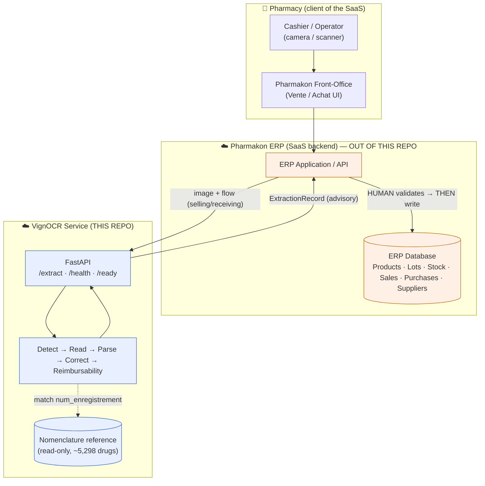

> **Boundary note.** Everything under *Pharmakon ERP* (the back-office, the relational database, the Vente/Achat business logic) is **external to this repository**. This repo is the VignOCR service plus its training/data tooling. ERP-side entities in §13 are documented as the **integration contract** and are **assumed pending validation** (see Q-7, §19).

### 4.3 Pharmacy Workflow Overview

| Workflow | Trigger | VignOCR role | ERP outcome (after human validation) |
| --- | --- | --- | --- |
| **Purchase / Stock-intake** | Delivery arrives from supplier | Extract identity + lot + dates + **PPA/TR**; complete identity from nomenclature via `num_enrg` | Create/match product, create **lot**, increase stock |
| **Sales** | Customer purchase at till | Validate medication; match product & **lot**; surface reimbursability | Deduct stock from the validated **lot**; record sale |
| **Supplier** | Onboarding / reconciliation | (Indirect) supports product matching | Maintain supplier catalogue, link deliveries |
| **Inventory** | Continuous | Lot-accurate intake/deduction inputs | Maintain per-lot quantities & traceability |

### 4.4 OCR During Purchases (Achat / Receiving)

**Minimum required fields the OCR must capture from the vignette:**

| Field | Why it is required at intake | Source |
| --- | --- | --- |
| `num_lot` (**LOT**) | A lot is the traceability unit; stock is held per lot | OCR (vignette) |
| `date_exp` | Expiry governs sellability, FEFO rotation, recalls | OCR (vignette) |
| `date_fab` | Manufacture date; sanity (`exp > fab`), shelf-life | OCR (vignette) |
| `num_enregistrement` (**num_enrg**) | The **key** that identifies the drug in the national nomenclature | OCR (vignette) |
| **`ppa` (PPA)** | Public price — **not present in the nomenclature**, so it *must* come from OCR (see §8, F-04) | OCR (vignette) |
| **`tr` (TR)** | Reference tariff — **also not in the nomenclature**; reimbursement-relevant | OCR (vignette) |

**Identity completion via the nomenclature.** Once `num_enregistrement` is read, it is normalized and matched against the national **nomenclature** reference. The matched record supplies the remaining identity fields — `product_name`, `dci`, `dosage`, `forme`, `laboratoire` — so OCR need not read them reliably. **Critically, the nomenclature carries no price**: `PPA` and `TR` can never be back-filled from it and remain OCR's responsibility (F-04).

**The human types only:** purchased **quantity**, **UG** (supplier free/bonus units), and **purchase price**. Everything else is pre-filled.

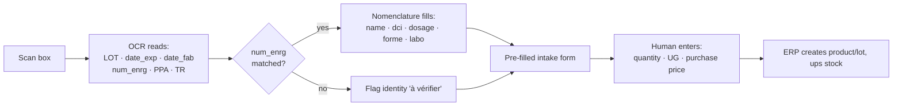

### 4.5 OCR During Sales (Vente / Selling)

At the till the **must-detect set is narrow: LOT is the priority**, plus enough identity to validate the medication being sold.

- **LOT detection requirement.** The cashier scans the box; the system reads `num_lot` and matches it to an existing on-hand lot of the product.
- **Inventory deduction requirement.** On cashier validation, the ERP **deducts the sold quantity from the matched lot** (not generic product stock). If the lot cannot be matched confidently, the system abstains and the cashier selects the lot manually.
- **Traceability requirement.** Recording the exact lot sold preserves end-to-end traceability (recalls, expiry audits, reimbursement claims).
- **Stricter abstention.** Selling uses a **higher confidence bar (τ = 0.90)** than receiving (τ = 0.75): a wrong dispense is unacceptable, so the system prefers to ask the human (`abstain`) than to assert.
- **Reimbursability.** The CHIFA badge is **not produced by OCR in v1** (D-1): it is derived at the ERP/product level from the **CHIFA reference base** (keyed by `dci`+`num_enregistrement`) and inherited at product creation. (Historically planned from the vignette colour band; descoped 2026-06-06.)
- **Real-world reality.** OCR is an **accelerator, never a hard dependency**: if it abstains, errors, or is unreachable, the cashier completes the sale by hand. No stock is ever deducted before the cashier's validation event.

---

## 5. Current System Audit

This section audits each existing subsystem using the mandated lens: **Purpose · Current Implementation · Strengths · Weaknesses · Risks · Recommendations**. Implementation status uses: ✅ FULL (CPU-runnable today) · 🟦 ML-GATED (coded, requires the `[ml]` extra, lazy-imported) · 🟨 PARTIAL · ⬜ STUB/PLANNED.

### 5.1 Configuration Core (`configs/`, `src/vignocr/common/`)
- **Purpose.** Be the single source of truth for the field schema, parsing rules, thresholds and correction policy, so nothing is hardcoded.
- **Current Implementation.** ✅ FULL. `common/config.py` loads YAML with env overrides (12-factor, e.g. `VIGNOCR_DATA_ACTIVE`); `common/schemas.py` defines the canonical Pydantic types; `logging.py` (structlog), `seeding.py` (lazy-torch), `metrics.py` (P/R/F1, localization recall) complete the core. Eight config files: `classes.yaml`, `data.yaml`, `parsing/fields.yaml`, `nomenclature/correction.yaml`, `detection/rfdetr_medium.yaml`, `detection/rfdetr_vignette.yaml`, `ocr/recognition.yaml`, `ocr/finetune.yaml`.
- **Strengths.** Rigorous config-driven discipline; class mapping is by **name** not id (robust to Roboflow id shuffling); money typed as `Decimal` end-to-end.
- **Weaknesses.** `classes.yaml` declares 17 classes but synthetic emits 15 (F-06); inline comments in `data.yaml` carry the inverted `entete`/`vin` semantics (F-01) and stale reconciliation notes.
- **Risks.** Comments are read as truth by humans and AI agents; an inverted comment propagates into a real bug.
- **Recommendations.** Correct the `entete`/`vin` comments; reconcile the class count; add a machine-checkable assertion that synthetic coverage == declared schema (or document the intentional gap).

### 5.2 Data / Dataset Subsystem (`src/vignocr/data/`, `fixtures/`)
- **Purpose.** Generate the synthetic fixture, load/validate/measure COCO datasets.
- **Current Implementation.** ✅ FULL. `synthetic.py` (PIL generator → 15-class COCO + `ground_truth.json` + `nomenclature.csv`), `coco.py` (split loader, per-image indexing, field cropping), `validate.py` (integrity asserts), `stats.py` (class/split stats, box-size quartiles).
- **Strengths.** The synthetic fixture lets the entire downstream pipeline run and be tested on CPU before any real label exists; integrity asserts (no leakage, valid bbox, class ⊆ schema, business-critical coverage) are real and enforced.
- **Weaknesses.** Synthetic ≠ real distribution (clean renders vs webcam photos); synthetic omits `ppa_shp`/`tr` (so the very classes the real data *does* carry are *untested* synthetically).
- **Risks.** Green CI on synthetic gives false confidence about real-data readiness.
- **Recommendations.** Extend synthetic to emit `ppa_shp` and `tr` (close F-06's test gap); add a real-data stats report to the validation gate.

### 5.3 Detection Subsystem (`src/vignocr/detection/`)
- **Purpose.** Stage A (find the vignette in a box photo) and Stage B (find the 17 field/region classes) via RF-DETR; eval, ONNX export, inference.
- **Current Implementation.** 🟦 ML-GATED. `train.py`, `eval.py`, `export.py`, `infer.py` complete but lazy-import `torch`/`rfdetr`/`onnx`/`onnxruntime`; `_resolve.py` (config↔dataset binding) is ✅ FULL. Three small `TODO(rfdetr-api)` notes are enhancement hints, not blockers.
- **Strengths.** Clean separation; ONNX export + parity check designed in; config-driven hyperparameters; band-colour-preserving augmentation (protects reimbursability).
- **Weaknesses.** **Never successfully trained** (see §6.3 / memory); real datasets are schema-misaligned (§7); Stage A is bound to `data2` whose `entete`/`vin` semantics are inverted in docs (F-01).
- **Risks.** First successful training run may converge to a model that *cannot read prices/reimbursability* because the data lacks those labels (F-02, F-05).
- **Recommendations.** Resolve data gaps first; re-scope to the business-critical class set (F-08); smoke-train one epoch in `salloc` before the DAG.

### 5.4 OCR / Recognition Subsystem (`src/vignocr/ocr/`)
- **Purpose.** Per-field text recognition (money/code/date/text), orientation-correct crops, auto-labeling, fine-tune.
- **Current Implementation.** 🟦 ML-GATED. `infer.py`, `train.py`, `finetune.py`, `autolabel.py` lazy-import PaddleOCR/transformers; `preprocess.py` and `eval.py` are ✅ FULL (PIL/NumPy/rapidfuzz core; OpenCV lazy). Several `TODO(transformer/paddle-*-api)` are future scaffolding.
- **Strengths.** Per-field charset whitelisting narrows error surface; abstention wired to the config thresholds; CER eval implemented in core.
- **Weaknesses.** Recognizer unproven on real crops; transformer path is scaffolding only; depends on Stage B crops that are themselves blocked.
- **Risks.** OCR quality on vertical `vin` strips (lot/dates) and tiny price text is the make-or-break for both flows and is entirely unmeasured.
- **Recommendations.** Prioritize a recognition golden set for `num_lot`, dates, `ppa`/`ppa_shp`, `num_enregistrement`; validate orientation correction on real vertical strips.

### 5.5 Parsing Subsystem (`src/vignocr/parsing/`)
- **Purpose.** Deterministic normalization/validation: money (Decimal), dates, codes, `prix+shp==ppa` checksum, PPA disambiguation, `ppa_shp` split, record assembly.
- **Current Implementation.** ✅ FULL (CPU). `money.py` (Decimal-only), `checksum.py` (verify/repair/flag), `ppa.py` (final vs intermediate), `ppa_shp.py` (split combined box), `dates.py` (`exp>fab`), `codes.py`, `record.py`.
- **Strengths.** Money never float; checksum repairs the third value from two confident anchors and **flags** (never silently accepts) a mismatch; verified on the real `17400,96 + 2,50 = 17403,46` pattern.
- **Weaknesses.** **`codes.py` `num_enregistrement` regex does not match the real format `352/01 A 003/06/22`** (F-03); date format list may not cover all printed variants.
- **Risks.** F-03 silently breaks the nomenclature match key on real data, cascading into identity-completion failure for the entire purchase flow.
- **Recommendations.** Re-derive the `num_enregistrement` grammar from the real nomenclature + a sample of real vignettes; keep the synthetic format as one accepted variant.

### 5.6 Nomenclature Subsystem (`src/vignocr/nomenclature/`, `scripts/ingest_nomenclature.py`)
- **Purpose.** Load the reference register, fuzzy-match `num_enregistrement`, repair identity fields under a medical-safety policy.
- **Current Implementation.** ✅ FULL (CPU). `loader.py` (CSV → indexed lookup, graceful empty on missing), `match.py` (rapidfuzz structural edit-distance, block-weighted), `correct.py` (policy engine). `ingest_nomenclature.py` converts the official XLSX → CSV (header auto-detect, accent-tolerant column mapping).
- **Strengths.** Policy is exactly the safety core: `never_overwrite=[ppa,tr]`, `repair_always=[product_name,laboratoire]`, `repair_if_ocr_low_or_agree=[dci]`, `flag_on_conflict=[dosage,forme]`. Conflicts are reported, never guessed.
- **Weaknesses.** (1) **Match key format mismatch** (F-03). (2) **`tr` has no source column** in the real XLSX, and `tr` is ambiguously defined as *Tarif de Référence* (classes.yaml) vs *taux de remboursement* (ingest script) — F-09. (3) The real XLSX exposes a distinct **`CODE`** column (`01 A 003`) and a different `N°ENREGISTREMENT` shape that the ingest mapping has not reconciled.
- **Risks.** Matching/identity-completion is the backbone of the purchase flow; if the key or columns are wrong, the whole "fill from nomenclature" promise fails.
- **Recommendations.** Re-author `COLUMN_MAP` and the canonical code grammar against the shipped XLSX; decide the authoritative source of `tr` (vignette, per F-04) and remove the `tr` nomenclature column expectation or map it correctly; disambiguate the `tr` definition.

### 5.7 Pipeline Orchestrator (`src/vignocr/pipeline/`)
- **Purpose.** Compose the end-to-end flow and provide CPU stubs so the contract runs without ML.
- **Current Implementation.** ✅ FULL. `orchestrator.py` chains: (optional Stage A crop) → preprocess → detect → recognize → PPA disambiguate → `ppa_shp` split → parse+checksum → nomenclature correct → reimbursability → assemble `ExtractionRecord`. Backend auto-selects real (torch + weights present) or `stubs.py` (fixture-backed deterministic detector/recognizer). `preprocess.py` (deskew/denoise/contrast, hue-preserving) and `reimbursability.py` (HSV band hue → colour) are FULL.
- **Strengths.** The JSON contract and all post-processing are exercised on CPU today; backend selection is env-controlled (`VIGNOCR_PIPELINE_BACKEND`).
- **Weaknesses.** Stage A crop is **disabled by default** (so real box-photo cropping is untested in the default path); reimbursability has no real training/validation data (F-02).
- **Risks.** The "it runs" demo is entirely stub-fed; real-model integration is the untested seam.
- **Recommendations.** Add an integration test that runs the real backend on a handful of real crops once a checkpoint exists; gate Stage A enablement on F-01 resolution.

### 5.8 Serving / API (`src/vignocr/serving/`)
- **Purpose.** Expose extraction over HTTP for the ERP.
- **Current Implementation.** ✅ FULL for the sync surface. `app.py` implements `GET /health`, `GET /ready`, `POST /extract` (multipart image + `flow` + `idempotency_key`; MIME/size validation; returns `ExtractionRecord`). `deps.py` (env settings, lazy pipeline singleton, stub fallback), `schemas.py` (re-exports canonical types). **`POST /batch` + `GET /jobs/{id}` (async receiving) are planned, not implemented.**
- **Strengths.** Stateless, 12-factor, idempotency-key echo, clean error taxonomy (413/415/422/503); stub fallback means the container always boots.
- **Weaknesses.** **No authentication / rate-limiting middleware** is wired (designed in `docs/SECURITY.md`); async batch path absent; idempotency is echo-only (de-dup is the caller's job, by design).
- **Risks.** Shipping without auth in a multi-tenant SaaS is unacceptable; without async batch, large receiving runs hit a client-side loop.
- **Recommendations.** Implement auth + rate-limit before any external exposure; implement `/batch`+`/jobs` for receiving throughput; add `/metrics`.

### 5.9 Training & HPC Infrastructure (`slurm/`, `scripts/`)
- **Purpose.** Reproducibly train on the Narval (Digital Research Alliance) GPU cluster.
- **Current Implementation.** 🟨 PARTIAL/operational-but-failing. A full SLURM DAG (`submit_all.sh`: 01 validate → {02a vignette ∥ 02 detection} → 03 eval/export → 04 autolabel → ⏸ human gate → 05 finetune → 06 benchmark) with offline-first bootstrap (`setup_narval.sh`, `fetch_pretrained.sh`, `fix_install.sh`, `diagnose_run.sh`).
- **Strengths.** Reproducibility snapshots (git SHA, configs, seed, module stack); offline guards (`HF_HUB_OFFLINE`, cached `TORCH_HOME`); the **prior validate-vs-train dataset mismatch is FIXED** (stage 01 now validates `real`+`vignette` explicitly; `VIGNOCR_DATA_ACTIVE` defaults to `real` in `submit_all.sh`).
- **Weaknesses.** **No training job has ever succeeded** — a recurring offline dependency defect (`rfdetr[train,loggers]`/`pytorch_lightning` lazy-imported inside `model.train()` and skipped by `--no-index` installs); some `train.py` kwargs need fixing (`lr_backbone`→`lr_encoder`).
- **Risks.** The afterok DAG cancels all downstream stages on the first non-zero exit, so one ImportError stalls everything.
- **Recommendations.** Verify the *training* import chain (`import rfdetr.training`) in the setup verifier; one-epoch `salloc` smoke before submitting; pin the Lightning stack (already declared in `pyproject` `[ml]`).

### 5.10 Test Suite (`tests/`)
- **Purpose.** Lock the deterministic contract and dataset integrity on CPU.
- **Current Implementation.** ✅ FULL (CPU-only; no `@pytest.mark.ml`). 8 suites: dataset integrity, parsing/checksum goldens, nomenclature correction, pipeline e2e (stub), serving API, Stage A/C config binding + autolabel layout, benchmark (`@pytest.mark.slow`). `conftest.py` autouses a session-scoped synthetic fixture.
- **Strengths.** Money-to-the-centime and end-to-end JSON contract are regression-locked; everything runs without a GPU.
- **Weaknesses.** Zero coverage of real ML inference, real images, auth, or async; "green" reflects the synthetic world only.
- **Risks.** A passing suite masks the real-data and ML risks that dominate the project.
- **Recommendations.** Add real-data fixtures behind an `ml`/`realdata` marker; add a contract test for the `num_enregistrement` real format (currently would fail — useful as a red test pinning F-03).

---

## 6. OCR Architecture Audit

### 6.1 Data Layer
*(Full numbers in §7.)* Two real Roboflow COCO exports and one synthetic fixture:

| Dataset | Role | Images | Classes (annotated) | Key issues |
| --- | --- | --- | --- | --- |
| `data/` | Stage B field detector | 773 (542/154/77) | 12 real classes incl. `lot`, `ppa`, `ppa_shp`, `tarif_ref`; **no `prix`/`shp`/`entete`/`vin`/`color_band`** | F-02, F-05, F-07 |
| `data2/` | Stage A vignette-region detector | 750 (549/101/100) | `entete`(551), `vin`(552); **`date_info`=0** | F-01, date_info empty |
| `fixtures/synthetic` | CPU dev/test | 20 (12/4/4) | 15 of 17 (`ppa_shp`,`tr`=0) | F-06 |

- **Annotation format.** COCO (`_annotations.coco.json` per split, Roboflow convention). Mapping by category **name**, with `data.yaml` aliases (`lot→num_lot`, `tarif_ref→tr`) and ignores (`drug-labels`, `text`).
- **Annotation quality.** Generally consistent box counts per image; but **coverage gaps** (missing classes) and **one starved class** (`dosage` 62) are the issue, not box noise.
- **Distribution / balance.** `data/` is moderately balanced across 11 classes (≈420–640 train) except `dosage` (62) and the auxiliary `text` (197). `data2/` is effectively 2-class and balanced.
- **Missing annotations / ambiguous labels.** `prix`,`shp` (fused into `ppa_shp`), `color_band` (0), `entete`/`vin` semantics inverted vs docs, `date_info` declared-but-empty. See §7 and §17.

### 6.2 Vision Pipeline

**Figure 2 — Two-Stage Detect-then-Read Data-Flow Pipeline**

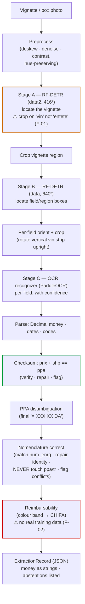

- **Detection pipeline.** Two RF-DETR detectors (Stage A region, Stage B fields). Stage A crop is **disabled by default** in the orchestrator today.
- **Classification pipeline.** **Descoped from v1 (D-1).** Reimbursability was designed as a separate colour-band signal (HSV hue → green/red/orange); it is now an ERP/CHIFA-base derivation, not part of the OCR pipeline. `color_band` is dropped from the detection scope.
- **OCR pipeline.** PaddleOCR PP-OCRv4 (SVTR-LCNet rec head), French, detection disabled (RF-DETR localizes), per-field-type preprocessing + charset whitelists; optional CRNN/MobileNetV3 fine-tune on human-corrected crops.
- **Post-processing pipeline.** Deterministic and FULL: money/dates/codes parsing, `prix+shp==ppa` checksum (repair/flag), `ppa_shp` split, PPA final-line disambiguation, nomenclature correction, abstention gating.

### 6.3 Model Layer

| Aspect | Stage A (vignette) | Stage B (fields) | Stage C (OCR) |
| --- | --- | --- | --- |
| Model | RF-DETR Medium | RF-DETR Medium | PaddleOCR PP-OCRv4 rec (+ optional CRNN fine-tune) |
| Input | 416×416 | 640×640 | per-field crops |
| Config | `detection/rfdetr_vignette.yaml` (`dataset: vignette`) | `detection/rfdetr_medium.yaml` (`dataset: real`) | `ocr/recognition.yaml`, `ocr/finetune.yaml` |
| Train | 30 epochs, bs 8 | 50 epochs, bs 4 (CPU) / ≥16 (A100) | 80 epochs, bs 128 (fine-tune) |
| Status | 🟦 coded, **never trained** | 🟦 coded, **never trained** | 🟦 coded, **never trained** |

- **Architectural decisions.** Detect-then-read (not end-to-end) to isolate localization from recognition and allow per-field charsets/abstention. RF-DETR chosen for a fixed-but-photographed layout (global attention, real-time variant). PaddleOCR baseline preferred over transformer (latency, CPU-export, short fixed fields).
- **Training approach.** Config-driven, seeded, reproducible; ONNX export with parity check; OCR auto-label (Stage 04) then human-gated fine-tune (Stage 05).
- **Inference approach.** ONNX for the detector (CPU `onnxruntime` in the serving image); PaddleOCR for recognition. **Today the serving container has no ML libs → it runs the stub backend** (F-deploy).
- **Latency constraints.** Targets are aspirational and **unmeasured on real models** (illustrative `timings_ms`: detect ~180 ms, ocr ~240 ms, total ~1.48 s).
- **Scalability constraints.** GPU worker pool + stateless CPU API tier is designed (`docs/SERVING.md`) but not provisioned.

The reproducible training path is the SLURM DAG submitted on the Narval HPC cluster (`slurm/submit_all.sh`). It is operational scaffolding but **has never completed end-to-end** (T-1).

**Figure 14 — Training DAG (SLURM / Narval HPC)**

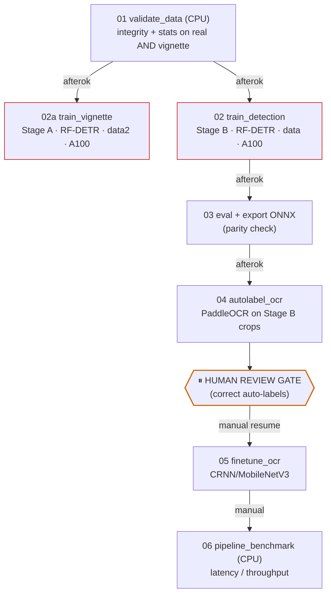

> One non-zero exit cancels the downstream `afterok` chain — a single offline-cluster ImportError (T-1) stalls the whole DAG. Smoke-test one epoch in `salloc` before submitting.

### 6.4 Cloud Deployment Constraints

The final OCR system is **cloud-hosted SaaS**, **not** on pharmacy machines. Implications:

**Figure 3 — Target Cloud / SaaS Deployment Architecture**

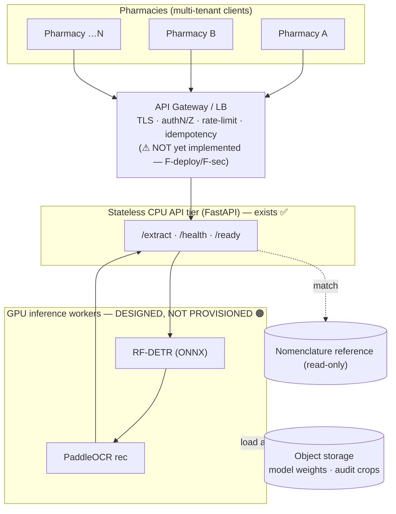

| Concern | Implication & current gap |
| --- | --- |
| **Inference latency** | Selling popup targets ~2 s. Achievable only with GPU workers + warm models; **today's image is CPU/stub** → real latency unknown. |
| **Scaling** | Stateless API scales horizontally; GPU pool autoscaling is the cost/throughput lever — **not provisioned**. |
| **Cost** | GPU is the dominant cost. Re-scoping the detector (F-08) and ONNX/CPU paths for light fields reduce spend. Extraction is side-effect-free, so retries are "just GPU cost". |
| **Availability** | OCR must be a **soft dependency**: every flow falls back to manual entry on 5xx/429/timeout. The contract already mandates this. |
| **Multi-tenancy** | Service is stateless and tenant-agnostic today; **tenant isolation, auth scoping, per-tenant rate limits, and audit segregation are NOT implemented** (F-sec). Nomenclature is shared/national (not per-tenant). |

---

## 7. Dataset Audit

### 7.1 Verified Inventory (independently recomputed 2026-06-06)

**`data/` — Stage B field detector (773 images; 542 train / 154 val / 77 test).** Train per-class annotation counts:

| Class (real name → schema) | train | val | test | Note |
| --- | --- | --- | --- | --- |
| `forme` | 639 | 181 | 86 | |
| `dci` | 594 | 166 | 86 | |
| `num_enregistrement` | 554 | 148 | 80 | anchor key |
| `product_name` | 550 | 157 | 78 | |
| `laboratoire` | 543 | 154 | 79 | |
| `date_exp` | 531 | 149 | 74 | |
| `date_fab` | 525 | 147 | 74 | |
| `lot` → `num_lot` | 513 | 148 | 73 | aliased |
| `ppa` | 421 | 121 | 62 | |
| `ppa_shp` | 408 | 105 | 57 | **fused prix+shp** |
| `tarif_ref` → `tr` | 252 | 63 | 33 | aliased |
| `dosage` | **62** | 16 | 10 | **starved (F-07)** |
| `text` (ignored) | 197 | 85 | 44 | not a target class |
| `drug-labels` (root) | 0 | 0 | 0 | container category |
| **`prix`, `shp`, `entete`, `vin`, `color_band`** | **absent** | — | — | **F-05, F-02** |

**`data2/` — Stage A vignette-region detector (750 images; 549/101/100).**

| Class | train | val | test | Geometry (verified) |
| --- | --- | --- | --- | --- |
| `vin` | 552 | 102 | 101 | **38.7 % area, aspect 1.51, centred, 76 % width → the whole vignette body** |
| `entete` | 551 | 102 | 101 | **6.9 % area, aspect 0.36, 16 % width → small vertical lot/date strip** |
| `date_info` | **0** | 0 | 0 | declared but **empty** → effectively 2-class |

**`fixtures/synthetic` (20 images).** Emits 15 classes (ids 0–14), one annotation each per image; **`ppa_shp` (15) and `tr` (16) have zero annotations** → F-06.

**Cross-set facts.** `data/` and `data2/` share **zero images** (773 vs 750 unique stems, 0 overlap) — different distributions, captured/cropped differently. `num_enregistrement` exists **only** in `data/`.

### 7.2 Data2 — Vignette & Entête Structure (focused analysis)

The project owner's business definition: *"The Entête inside the vignette is generally a sub-region containing `date_fab`, `date_exp`, `lot`."* The audit **confirms this** against geometry and a visual overlay:

**Figure 4 — Dataset Geometry: Stage A (`data2`) vs Stage B (`data`)**

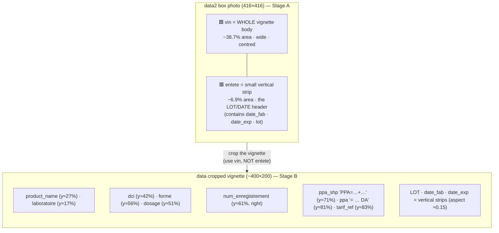

**Visual verification (audit overlays, §20.4).** A `data2` sample (CALCIDOSE 500) shows the green `vin` box enclosing the entire white vignette sticker and the red `entete` box on a thin vertical strip. A `data` sample (ENANTONE LP 3.75 mg) shows the exact price structure `PPA=17400,96+2,50` (intermediate `ppa_shp`) → `17 403,46 DA` (final `ppa`), with the lot/dates as vertical strips on the right and `TR` printed separately.

**Do current annotations reflect the business reality?**
- ✅ **Yes** that `entete` is a small lot/date sub-region (geometry matches the owner's definition).
- ⚠️ **But** the *design comments treat it inversely* (`data.yaml`: "entete = whole vignette body, used to crop") — **the crop must use `vin`**, not `entete` (**F-01**, High).
- ⚠️ The `entete` box is a **coarse region** — it does **not** separately annotate `date_fab`/`date_exp`/`lot` inside it, and `date_info` (which might have) is **empty**. So `data2` cannot, today, train precise lot/date localization; it can only crop the header block. Precise lot/date boxes exist only in `data/` (Stage B).

### 7.3 Annotation Reconciliation Verdict
- The **target 17-class schema is not a subset of either real export.** `data/` carries most field classes but **fuses `prix`+`shp` into `ppa_shp`** and lacks `entete`/`vin`/`color_band`; `data2/` carries only region classes.
- The documented capability set (prices, reimbursability) **cannot be trained from the current real labels** — re-annotation is on the critical path (Q-1…Q-3, §19).

---

## 8. Nomenclature Audit

### 8.1 Purpose & Role
The **national nomenclature** is the authoritative drug register. Its role in VignOCR is **identity completion**: given the OCR-read `num_enregistrement`, look up the canonical `product_name`, `dci`, `dosage`, `forme`, `laboratoire`. This lets the purchase flow avoid relying on OCR for the long identity texts — OCR only needs the **key** (`num_enrg`) plus the few fields the register does not hold.

### 8.2 Verified Structure of the Real Reference (`NOMENCLATURE-VERSION-FEVRIER-2026-.xlsx`)
- 3 sheets: **`Nomenclature Février 2026`** (~5,298 drug rows), `Non Renouvelés`, `Retraits`.
- Header at **row 14** (title/banner rows above are blank). Columns (19 populated):
  `N°`, **`N°ENREGISTREMENT`**, **`CODE`**, `DENOMINATION COMMUNE INTERNATIONALE` (DCI), `NOM DE MARQUE` (product_name), `FORME`, `DOSAGE`, `CONDITIONNEMENT`, `LISTE`, `P1`, `P2`, `OBS`, `LABORATOIRES DÉTENTEUR…`, `PAYS…`, `DATE D'ENREGISTREMENT INITIAL`, `DATE … FINAL`, `TYPE`, `STATUT`, `DURÉE DE STABILITÉ`.
- Sample row: `N°ENREGISTREMENT = 352/01 A 003/06/22`, `CODE = 01 A 003`, `DCI = CETIRIZINE…`, `NOM DE MARQUE = ARTIZ`, `FORME = COMPRIME PELLICULE`, `DOSAGE = 10MG`, `LABORATOIRE = EL KENDI INDUSTRIE`.

### 8.3 Critical Findings — "the nomenclature has no PPA"
- **F-04 (Critical), confirmed:** **there is no PPA column, and no price/tariff column of any kind** in the nomenclature. ➜ **`PPA` and `TR` MUST be captured by VignOCR from the vignette**; they can never be back-filled from the register. This is now a first-class requirement (BO-5, §4.4) and corrects the earlier project memory note that listed `ppa/tr` as nomenclature-filled.
- **F-03 (Critical):** the real key `352/01 A 003/06/22` ≠ the parser's `AA/BB/CC<LETTER>DDD/EEE`. There is also a separate **`CODE`** (`01 A 003`). The match key and grammar must be re-derived (the ingest script's own `TODO(real-data)` flags both the format gap and the missing `tr` source).
- **F-09 (Medium):** `tr` is **ambiguously defined** — *Tarif de Référence* (a price, per `classes.yaml`, money type) vs *taux de remboursement* (a rate, per the ingest `COLUMN_MAP`). The real XLSX has **neither** column, so `tr` is vignette-sourced regardless; the definition and the (now-spurious) nomenclature `tr` column must be reconciled.

### 8.4 Correction Policy (the medical-safety core)

**Figure 11 — Nomenclature Correction: Decision Flow**

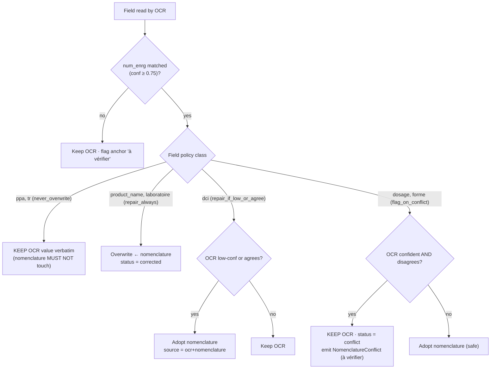

The implementation in `nomenclature/correct.py` enforces exactly this: `ppa`/`tr` are never altered; dispensing-critical conflicts (`dosage`/`forme`) are **flagged, never silently overwritten**. This is the project's hard safety invariant and is **correctly implemented**.

---

## 9. Business Constraints

| ID | Constraint | Type | Current posture |
| --- | --- | --- | --- |
| BC-1 | **Very low inference latency** (selling ~2 s) | Performance | Unmeasured; needs GPU serving |
| BC-2 | **High OCR accuracy** on business-critical fields (lot, dates, num_enrg, prices) | Quality | Gated (CER ≤ 5 %); not yet measurable |
| BC-3 | **Money exact to the centime**; `prix+shp==ppa` | Correctness | ✅ enforced (Decimal + checksum) |
| BC-4 | **Abstain over guess**; selling stricter than receiving | Safety | ✅ enforced (τ 0.90 / 0.75) |
| BC-5 | **PPA & TR captured by OCR** (not in nomenclature) | Data | ⚠️ requires annotation + parsing (F-04) |
| BC-6 | **Lot-accurate inventory** on sale | Correctness | Contract defined; ERP-side |
| BC-7 | **Pharmacy workflow compatibility** (extract→validate→write) | Process | ✅ in contract |
| BC-8 | **Supplier workflow compatibility** (UG, purchase price typed by human) | Process | Contract defined |
| BC-9 | **ERP integration** via stable JSON contract | Integration | ✅ `docs/INTEGRATION.md` |
| BC-10 | **Cloud / SaaS deployment**, not on pharmacy machines | Deployment | ⚠️ CPU image only; no IaC |
| BC-11 | **Multi-tenant isolation, auth, audit** | Security | 🔴 not implemented |
| BC-12 | **CHIFA reimbursability** | Feature | ✅ **ERP-derived (DCI+num_enrg → CHIFA base), NOT OCR** (D-1); colour band descoped from v1 |
| BC-13 | **Regulatory traceability** (lot, expiry, audit log) | Compliance | Partially designed |

---

## 10. Project Structure

> **Scope note.** This repository is the **VignOCR service + data/training tooling**. The Pharmakon ERP **backend and frontend are external** (out of this repo). Below, §10.1–10.4 document the **as-built OCR repo**; §10.5 documents the **ERP-side target structure as an integration contract** (assumed, pending Q-7).

### 10.1 As-Built Repository Layout
```
pharmakon-ocr/
├── AUDIT.md                       ← THIS document (single source of truth)
├── instructions.md                ← mandatory maintenance rules (new)
├── README.md · pyproject.toml · Dockerfile
├── configs/                       ◀ SINGLE SOURCE OF TRUTH
│   ├── classes.yaml               17-class schema + roles + reimbursability
│   ├── data.yaml                  dataset locations + aliases + integrity asserts
│   ├── parsing/fields.yaml        regexes · Decimal locale · checksum · PPA · abstention
│   ├── nomenclature/correction.yaml  match + correction policy (safety core)
│   ├── detection/{rfdetr_medium,rfdetr_vignette}.yaml
│   └── ocr/{recognition,finetune}.yaml
├── src/vignocr/
│   ├── common/   config · schemas · logging · seeding · metrics   (✅ FULL)
│   ├── data/     synthetic · coco · validate · stats              (✅ FULL)
│   ├── detection/ train · eval · export · infer · _resolve        (🟦 ML-GATED)
│   ├── ocr/      train · finetune · eval · infer · preprocess · autolabel (🟦)
│   ├── parsing/  money · dates · codes · checksum · ppa · ppa_shp · record (✅)
│   ├── nomenclature/ loader · match · correct                     (✅ FULL)
│   ├── pipeline/ orchestrator · preprocess · reimbursability · stubs (✅)
│   ├── serving/  app · deps · schemas (FastAPI)                   (✅ sync)
│   └── cli.py    extract · stats · gen-fixtures                   (✅ FULL)
├── scripts/   setup_narval · fetch_pretrained · fix_install · diagnose_run · ingest_nomenclature
├── slurm/     00…06 sbatch + submit_all.sh + lib.sh  (training DAG)
├── tests/     8 pytest suites (CPU-only)
├── docs/      15 design docs (see §20.3)
├── memory/    project memory (env failures, dataset gaps)
├── fixtures/synthetic/  + nomenclature.csv   (CPU dev/test)
├── data/  data2/   real Roboflow exports (schema-misaligned)
└── NOMENCLATURE-VERSION-FEVRIER-2026-.xlsx   (real reference)
```

### 10.2 OCR Services Structure (this repo)
- **Training:** `src/vignocr/{detection,ocr}/train.py|finetune.py`, driven by `slurm/` DAG.
- **Inference:** `src/vignocr/{detection,ocr}/infer.py`, `pipeline/orchestrator.py`, `serving/app.py`.
- **Monitoring:** designed in `docs/MONITORING.md` (per-field accuracy, drift, latency, dashboards) — **not implemented**.
- **Dataset management:** `src/vignocr/data/*`, `scripts/ingest_nomenclature.py`, COCO under `data/`,`data2/`,`fixtures/`.

### 10.3 Shared Infrastructure (this repo)
- **Authentication / RBAC:** designed (`docs/SECURITY.md`) — **not implemented** in `serving/`.
- **Audit logging:** structured logs (structlog) with request id/timings; tamper-evident audit store designed, not built.
- **Notifications:** N/A in OCR service (ERP concern).
- **File storage:** designed (object storage for weights + anonymized audit crops); container mounts `/models:ro`.

### 10.4 Backend Structure (OCR service viewpoint)
The OCR service is **stateless** and **domainless** in DDD terms; its "domains" are the pipeline stages. There are **no repositories/DTO layers/ORM** because it persists nothing (extraction is side-effect-free). The "API" is the three FastAPI routes; the "DTOs" are the Pydantic `serving/schemas.py` re-exports of the canonical `common/schemas.py` types.

### 10.5 ERP-Side Target Structure (integration contract — assumed, pending validation)
*(Documented so the audit is complete for onboarding; **not** part of this repo. Validate via Q-7.)*

- **Backend (Pharmakon):** domains likely include `Catalog/Product`, `Inventory/Lot/StockMovement`, `Purchasing/Achat`, `Sales/Vente`, `Suppliers`, `Pricing`, `Reimbursement/CHIFA`, `Audit`. Services orchestrate the **extract → validate → write** flow; repositories persist to the ERP DB; a `VignOcrClient` calls `/extract`.
- **Frontend (Pharmakon):** modules for **Vente** (till popup) and **Achat** (intake worksheet); a scan/capture component; prefill forms driven by `ExtractionRecord`; "à vérifier" badge system for `abstain`/`conflict`/`missing`/checksum-mismatch/reimbursability-unknown.
- **Shared:** auth/RBAC, audit logging, notifications, file/image storage — Pharmakon-owned.

---

## 11. Module Documentation

For each module: **Why it exists · Business logic · Module interactions**. (Technical status is in §5.)

### 11.1 `parsing`
- **Why.** Money and clinical values must be exact and validated, not "best-effort strings".
- **Business logic.** Normalize locale-variant money to `Decimal`; enforce `prix+shp==ppa`; pick the final PPA line; split the fused `ppa_shp`; validate dates (`exp>fab`) and the registration code.
- **Interactions.** ← OCR (raw reads) · → Nomenclature (provides `num_enrg`, identity) · → Pipeline/Serving (typed fields, checksum verdict) · supports **Purchases** (price/lot/dates) and **Sales** (lot, price sanity).

### 11.2 `nomenclature`
- **Why.** Complete drug identity from the authoritative register so OCR need not read long texts; **but never override price or guess a dispense**.
- **Business logic.** Normalize + fuzzy-match `num_enrg`; repair identity per policy; never touch `ppa`/`tr`; flag dispensing conflicts.
- **Interactions.** ← Parsing (`num_enrg`) · → Pipeline (`NomenclatureReport`, conflicts) · central to **Purchases** (identity completion) and **Sales** (product validation) · feeds **Analytics/Finance** indirectly (correct identity → correct reporting).

### 11.3 `detection`
- **Why.** Localize the vignette (Stage A) and the fields/regions (Stage B) so each can be read in isolation.
- **Business logic.** RF-DETR boxes labelled by the schema; band-colour preserved for reimbursability.
- **Interactions.** → OCR (crops) · → Reimbursability (`color_band`) · gated by **Datasets** (annotation coverage).

### 11.4 `ocr`
- **Why.** Read each localized field with a tailored recognizer and **abstain** when unsure.
- **Business logic.** Per-field-type preprocessing + charset; confidence → abstention by flow.
- **Interactions.** ← Detection (crops) · → Parsing (raw text + confidence) · governs **Sales** (lot/identity validation) and **Purchases** (price/lot/dates).

### 11.5 `pipeline`
- **Why.** Compose the stages into one deterministic, testable flow and provide CPU stubs.
- **Business logic.** Detect → read → parse → checksum → PPA → correct → reimbursability → assemble.
- **Interactions.** Orchestrates all of the above; → Serving (`ExtractionRecord`).

### 11.6 `serving`
- **Why.** Expose extraction to the ERP over HTTP as an advisory service.
- **Business logic.** Validate upload, run pipeline for the requested `flow`, return the record; never write.
- **Interactions.** ↔ Pharmakon ERP (the integration seam, `docs/INTEGRATION.md`); → Inventory/Purchases/Sales **only via** the ERP after human validation.

### 11.7 `common` & `data`
- **Why.** `common` removes hardcoding and centralizes types; `data` makes the pipeline testable before real labels exist.
- **Interactions.** Used by every module; `data` underpins **Datasets/Training**.

---

## 12. Functional Specifications

For each functionality: **Description · Dependencies · Impact Analysis**.

### FS-1 Vignette region detection (Stage A)
- **Description.** Locate the vignette in a box photo and crop it for field detection.
- **Dependencies.** `data2` (`vin` box — **not** `entete`, F-01); RF-DETR; `pipeline/orchestrator` (currently disabled by default).
- **Impact.** Wrong region → all downstream fields wrong. Enabling it before fixing F-01 would crop the lot/date strip and discard the vignette.

### FS-2 Field/region detection (Stage B)
- **Description.** Locate the field boxes (prices, codes, dates, identity) and `color_band`.
- **Dependencies.** `data/`; RF-DETR; `classes.yaml`.
- **Impact.** Missing labels (`prix`/`shp`/`color_band`) → those capabilities silently absent (F-02, F-05). Localization recall on business-critical fields is the detection gate.

### FS-3 Per-field OCR (Stage C)
- **Description.** Read each crop with a charset-constrained recognizer + confidence.
- **Dependencies.** Stage B crops; PaddleOCR; `ocr/recognition.yaml`; abstention thresholds.
- **Impact.** Drives both flows; abstention precision determines how often humans are interrupted.

### FS-4 Money parsing + checksum
- **Description.** Decimal money; `prix+shp==ppa` verify/repair/flag; split `ppa_shp`; pick final PPA.
- **Dependencies.** `parsing/*`; `fields.yaml`.
- **Impact.** Financial correctness; a mismatch blocks one-click confirm (selling).

### FS-5 Nomenclature identity completion
- **Description.** Match `num_enrg`, fill identity, never touch price, flag conflicts.
- **Dependencies.** `nomenclature/*`; the ingested CSV; **a working real-format key (F-03)**.
- **Impact.** Backbone of the purchase prefill; failure → operator re-keys identity.

### FS-6 Reimbursability (CHIFA) — **OUT OF OCR SCOPE for v1 (D-1)**
- **Description.** **Not an OCR function in v1.** Reimbursability is derived deterministically by the ERP: a drug is reimbursable if it exists in the **CHIFA reference base**, looked up by **`dci` + `num_enregistrement`**; the attribute is inherited when the product is created in the pharmacy system.
- **Dependencies.** ERP product/stock layer + CHIFA reference base (external). OCR contributes only `num_enregistrement` (and, via nomenclature, `dci`).
- **Impact.** No `color_band` detection, no HSV band head in v1. `pipeline/reimbursability.py` is retained but unused; `ExtractionRecord.reimbursability` is not populated by v1 (kept for wire-compat). See §3.8 D-1.

### FS-7 Abstention gating
- **Description.** Below-threshold fields → `abstain` (selling stricter).
- **Dependencies.** `fields.yaml: abstention`; `flow`.
- **Impact.** Safety lever; the same read can be `ok` (receiving) and `abstain` (selling).

### FS-8 Extraction API
- **Description.** `POST /extract` (sync), `/health`, `/ready`.
- **Dependencies.** `serving/*`; pipeline; (designed) auth.
- **Impact.** The only integration surface today; no auth/async (F-sec, batch planned).

### FS-9 Stock-intake prefill (Purchase)
- **Description.** Produce a record that pre-fills the intake form; human adds quantity/UG/price.
- **Dependencies.** FS-1…FS-5; **PPA/TR via OCR** (F-04); ERP intake form.
- **Impact.** BO-1; depends on nomenclature key + price capture.

### FS-10 Sales validation (Vente)
- **Description.** Validate medication + **lot**; drive lot-accurate deduction.
- **Dependencies.** FS-2…FS-4, FS-7; ERP lot/stock; stricter τ.
- **Impact.** BO-2; lot mismatch → manual lot selection; never deduct before validation.

---

## 13. Database & Data-Model Design

> **The OCR service is stateless and owns no database.** The relevant data models are: (A) the **`ExtractionRecord` wire schema** (produced by this service), (B) the **nomenclature reference schema** (read-only), (C) the **COCO dataset schema** (training), and (D) the **assumed ERP relational model** (integration contract — pending Q-7).

### 13.1 Constraints common to all money/identity data
- Money: `Decimal`, centime-quantized, serialized as **string** (never float).
- `confidence ∈ [0,1]` (clamped). `status ∈ {ok, abstain, corrected, conflict, missing}`. `source ∈ {ocr, nomenclature, ocr+nomenclature, checksum, none}`.
- `num_enregistrement` is the cross-reference key to the nomenclature (real format `352/01 A 003/06/22`, F-03).

### 13.2 `ExtractionRecord` — Wire Schema (produced by VignOCR)

**Figure 12 — `ExtractionRecord` Entity Relationship**

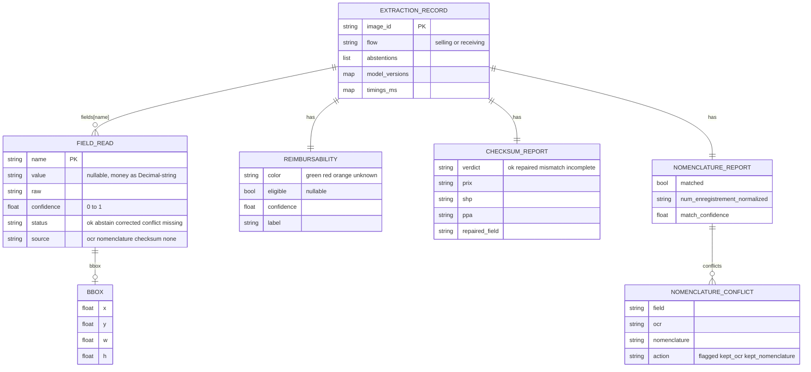
*Authoritative definition: `src/vignocr/common/schemas.py` (re-exported by `serving/schemas.py` — no duplication).*

### 13.3 Nomenclature Reference Schema (read-only)
- Key: `N°ENREGISTREMENT` (+ distinct `CODE`). Attributes: `DCI`, `NOM DE MARQUE`, `FORME`, `DOSAGE`, `CONDITIONNEMENT`, `LISTE`, `LABORATOIRE`, `PAYS`, `TYPE`, `STATUT`, registration dates, `DURÉE DE STABILITÉ`. **No price/PPA/TR.** Ingested subset (per `correction.yaml`): `num_enregistrement, product_name, dci, dosage, forme, laboratoire, tr*` (*`tr` currently unsourced — F-09).

### 13.4 Assumed ERP Integration Data Model (pending validation)

**Figure 13 — Integration Data Model (Nomenclature ↔ ERP)**

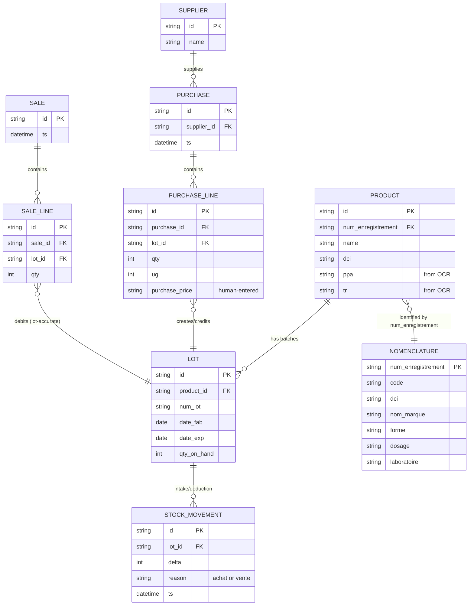

> **Key data-design consequence of F-04:** `PRODUCT.ppa` / `PRODUCT.tr` (or a price entity) are populated from **OCR**, not from `NOMENCLATURE`. The ERP must persist the OCR-captured price; the nomenclature link supplies only identity.

---

## 14. Workflow Documentation

### 14.1 Conventions
All workflows obey the golden rule: **extract → human-validate → THEN write.** VignOCR never writes; the ERP writes only on the human's validation event.

### 14.2 OCR Extraction (service-internal) — covered by Figure 2 (§6.2).

### 14.3 OCR Extraction — Activity Diagram

**Figure 5 — OCR Extraction Internal Activity**

```mermaid
flowchart TD
    A([Receive image + flow]) --> B[Validate MIME/size]
    B -->|invalid| E1[[415/413/422]]
    B -->|ok| C[Preprocess]
    C --> D{Real backend?<br/>torch + weights}
    D -- no --> S[Stub detector+recognizer<br/>from fixture ground truth]
    D -- yes --> DET[RF-DETR detect]
    DET --> OCR[PaddleOCR per field]
    S --> P[Parse + checksum + PPA]
    OCR --> P
    P --> N[Nomenclature correct]
    N --> R[Reimbursability]
    R --> G{Per-field conf ≥ τ(flow)?}
    G -- no --> AB[status=abstain → abstentions]
    G -- yes --> OK[status=ok/corrected]
    AB --> ASM[Assemble ExtractionRecord]
    OK --> ASM
    ASM --> Z([Return JSON 200])
```

### 14.4 Purchase / Stock-Intake (Achat) — Sequence

**Figure 6 — Purchase / Stock-Intake Workflow**

```mermaid
sequenceDiagram
    actor Op as Operator
    participant POS as Pharmakon Achat UI
    participant ERP as Pharmakon Backend
    participant OCR as VignOCR /extract
    participant NOM as Nomenclature
    Op->>POS: Scan delivered box
    POS->>ERP: upload image (flow=receiving)
    ERP->>OCR: POST /extract?flow=receiving
    OCR->>OCR: detect → read (LOT,dates,num_enrg,PPA,TR)
    OCR->>NOM: match num_enregistrement
    NOM-->>OCR: identity (name,dci,dosage,forme,labo)
    OCR-->>ERP: ExtractionRecord (PPA/TR from OCR; identity from NOM)
    ERP-->>POS: prefilled intake worksheet (+ à vérifier badges)
    Op->>POS: enter quantity, UG, purchase price; resolve flags; VALIDATE
    POS->>ERP: confirm
    ERP->>ERP: create/match Product, create Lot, increase stock
    Note over ERP: WRITE happens only here (after validation)
```

### 14.5 Sales Validation (Vente) — Sequence

**Figure 7 — Sales Validation Workflow**

```mermaid
sequenceDiagram
    actor Ca as Cashier
    participant POS as Pharmakon Vente UI
    participant ERP as Pharmakon Backend
    participant OCR as VignOCR /extract
    Ca->>POS: Scan box at till
    POS->>ERP: upload image (flow=selling)
    ERP->>OCR: POST /extract?flow=selling (strict τ=0.90)
    OCR-->>ERP: ExtractionRecord (num_lot, identity, reimbursability)
    ERP->>ERP: match product + on-hand LOT by num_lot
    alt Lot matched confidently
        ERP-->>POS: prefilled sale line (product, lot, CHIFA badge)
    else Lot uncertain / abstain
        ERP-->>POS: ask cashier to select lot manually
    end
    Ca->>POS: review, confirm sale
    POS->>ERP: validate
    ERP->>ERP: deduct qty from validated LOT; record sale
    Note over ERP: lot-accurate deduction only after validation
```

### 14.6 Supplier Workflow

**Figure 8 — Supplier Workflow**


### 14.7 Inventory Deduction (Lot-Level)

**Figure 9 — Inventory Deduction Workflow**

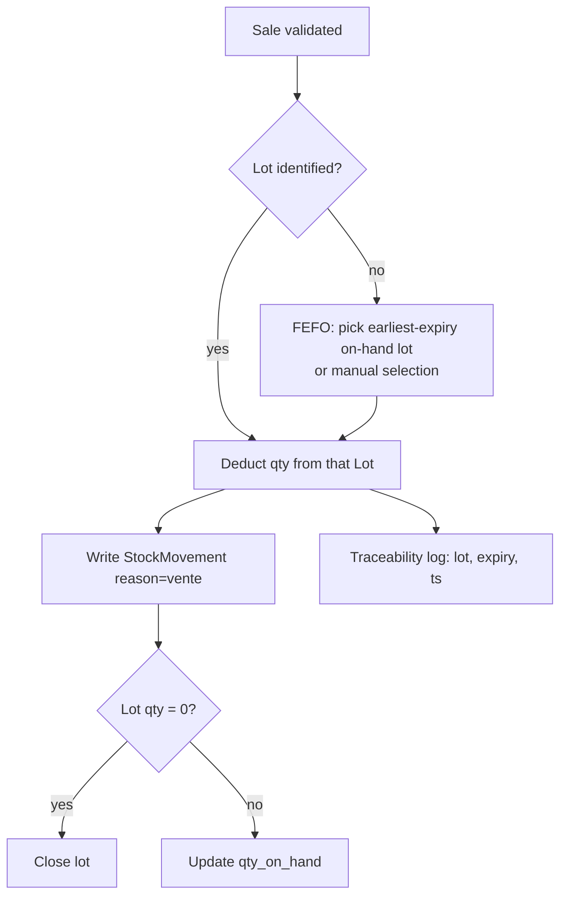

### 14.8 Invoice / Reconciliation Workflow

**Figure 10 — Invoice / Reconciliation Workflow**

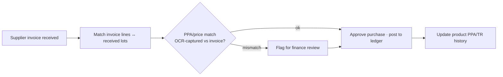
> *Invoice handling is an ERP concern; VignOCR contributes the OCR-captured `PPA`/`TR` that make price reconciliation possible (F-04). Invoice-document OCR is a future extension (`docs/FUTURE.md`).*

---

## 15. Non-Functional Requirements

| Category | Requirement | Target | Current |
| --- | --- | --- | --- |
| **Performance** | Selling extraction latency | p95 ≤ ~2 s | Unmeasured (stub CPU only) |
| | Receiving throughput | Batch/async | `/batch` planned |
| **Security** | TLS, authN/Z, per-tenant scoping | Mandatory before exposure | 🔴 not implemented |
| | Upload validation (MIME/size/decode) | Enforced | ✅ in `/extract` |
| | Audit logging (extraction + corrections, tamper-evident) | Required | 🟨 structured logs only |
| | Data minimization (crop-only, strip PII) | Required | Designed (HITL) |
| **Availability** | OCR is a soft dependency | Manual fallback always | ✅ in contract |
| | Service SLO | e.g. 99.5 % | Not defined/provisioned |
| **Scalability** | Stateless API horizontal scale | Yes | ✅ design |
| | GPU worker autoscaling | Yes | 🟠 not provisioned |
| | Multi-tenancy | Isolated, fair | 🔴 not implemented |
| **Maintainability** | Config-driven, no hardcoding | Enforced | ✅ strong |
| | Reproducible training | Snapshots | ✅ in `slurm/lib.sh` |
| | Doc/AUDIT kept current | Mandatory | ⚠️ this audit + `instructions.md` |
| **Observability** | Per-field accuracy, drift, latency, GPU | Dashboards | 🔴 designed only |
| | Request tracing / idempotency-key | Correlatable | ✅ echo + logs |

---

## 16. Risk Analysis

### 16.1 Technical Risks
| Risk | Likelihood | Impact | Mitigation |
| --- | --- | --- | --- |
| T-1 Training never converges on offline HPC (dep provisioning) | High | High | Verify `rfdetr.training` import; `salloc` 1-epoch smoke; pin Lightning (done in `[ml]`); `fix_install.sh` |
| T-2 `num_enregistrement` parser fails on real format (F-03) | **Certain** | High | Re-derive grammar from real XLSX + vignettes; add red contract test |
| T-3 OCR accuracy on vertical strips / tiny price text below gate | Medium | High | Orientation tests; per-field goldens; fine-tune on corrected crops |
| T-4 Serving ships without GPU/auth | Medium | High | GPU image + IaC; auth/rate-limit middleware before exposure |
| T-5 Stage A crop enabled with inverted region (F-01) | Medium | High | Fix comments; crop on `vin`; gate enablement on F-01 |

### 16.2 Business Risks
| Risk | Impact | Mitigation |
| --- | --- | --- |
| B-1 Wrong dispense from over-trusting OCR | Severe (safety) | Stricter selling τ; abstain/flag; human validation gate (all present) |
| B-2 Wrong price recorded | Financial | Decimal + checksum; PPA from OCR; invoice reconciliation |
| B-3 CHIFA badge undeliverable (F-02) | Feature/credibility | ✅ Resolved by D-1 — reimbursability is ERP/CHIFA-base derived, not OCR |
| B-4 Operator friction from over-abstention | Adoption | Tune per-field τ on real abstention-precision data |

### 16.3 Data Risks
| Risk | Impact | Mitigation |
| --- | --- | --- |
| DR-1 Real datasets can't train documented capabilities (F-05) | Blocks core value | Re-annotation sprint to the **re-scoped** must-capture schema (D-2); F-02 removed by D-1 |
| DR-2 `dosage` starvation (F-07) → false conflicts | Quality | Targeted annotation; treat low-data fields as repair-from-nomenclature |
| DR-3 Synthetic ≠ real distribution | False confidence | Real-data eval gate before promotion |
| DR-4 Nomenclature key/column mismatch (F-03,F-09) | Identity completion fails | Re-author ingest mapping + canonical code |

### 16.4 Deployment Risks
| Risk | Impact | Mitigation |
| --- | --- | --- |
| P-1 No GPU image / IaC | Can't run real models in prod | Build GPU image; add k8s/compose + autoscaling |
| P-2 No multi-tenant isolation/auth (F-sec) | Security/compliance | Gateway auth, tenant scoping, audit segregation |
| P-3 Container runs stub silently | Wrong "working" signal | `/ready` must report `stub:true`; alert on stub in prod |

---

## 17. Findings Register (Consolidated)

| ID | Sev | Area | Finding | Evidence | Recommended action | Status |
| --- | --- | --- | --- | --- | --- | --- |
| F-01 | 🟠 High | Datasets/Config | `entete`/`vin` semantics inverted in design comments; crop must use `vin` (whole body), not `entete` (small strip) | Geometry (entete 6.9 %/aspect 0.36; vin 38.7 %/aspect 1.51) + visual overlay; `data.yaml` comment | Fix comments; crop on `vin`; gate Stage A | Open |
| F-02 | ✅ Resolved | Datasets | `color_band` = 0 real annotations → reimbursability untrainable | per-class counts across `data/`,`data2/` | **Descoped (D-1):** reimbursability is ERP/CHIFA-base derived (DCI+num_enrg), not OCR | Resolved 2026-06-06 |
| F-03 | 🔴 Crit | Parsing/Nomenclature | `num_enregistrement` regex ≠ real `352/01 A 003/06/22`; distinct `CODE` ignored | `fields.yaml` regex; XLSX row sample; ingest TODO | Re-derive grammar + match key | Open |
| F-04 | 🔴 Crit | Nomenclature | Nomenclature has **no PPA/price**; PPA & TR must be OCR-captured | XLSX columns (19) — no price | Make PPA/TR first-class OCR fields; persist in ERP | Open (owner-confirmed) |
| F-05 | 🟠 High | Datasets | `prix`/`shp` not annotated; fused as `ppa_shp`; checksum relies on parser split | `data/` categories | Annotate or validate split on real OCR | Open |
| F-06 | 🟠 High | Config/Docs | Class drift: 17 declared vs 15 synthetic vs "15" in docs | `classes.yaml` vs synthetic counts vs README | Reconcile; extend synthetic to 17 | Open |
| F-07 | 🟡 Med | Datasets | `dosage` starved (62 train) | per-class counts | Targeted annotation; lean on nomenclature | Open |
| F-08 | ✅ Approved | Architecture | Detector over-scoped vs narrow business must-capture set | business priority (memory) + §4 | **Approved (D-2):** re-scope to LOT/dates/num_enrg/PPA/TR + vignette region | Approved 2026-06-06 |
| F-09 | 🟡 Med | Nomenclature | `tr` ambiguous (Tarif de Référence vs taux de remboursement); no source column | `classes.yaml` vs ingest `COLUMN_MAP`; XLSX | Define `tr`; treat as vignette-sourced | Open |
| F-10 | 🟡 Med | Datasets | `data2.date_info` declared but empty (0 anns) → effectively 2-class | per-class counts | Drop or annotate `date_info` | Open |
| F-sec | 🟠 High | Serving | No auth/rate-limit/multi-tenant isolation implemented | `serving/app.py` | Implement before external exposure | Open |
| F-deploy | 🟠 High | Deployment | CPU-only image, no GPU/IaC → prod would run stub | Dockerfile; no manifests | GPU image + IaC; alert on stub | Open |
| F-doc | 🟡 Med | Docs | Several docs stale vs real data (README, DATASET, NOMENCLATURE_CORRECTION, SWITCHOVER) | doc audit §5/agent | Reconcile against this register | Open |
| F-fixed | ✅ | Training | Prior validate-vs-train dataset mismatch | `submit_all.sh`, `01_validate_data.sbatch` | (already fixed) | Resolved |

---

## 18. Implementation Status Tracker

> **Update this section on every material change.** Legend: ✅ done · 🟦 coded/ML-gated/unproven · 🟨 partial · 🟠 designed-only · 🔴 missing/blocked.

### 18.1 Implemented (CPU-runnable today)
- ✅ Config core + canonical schemas (`common/`)
- ✅ Synthetic generation, COCO load/validate/stats (`data/`)
- ✅ Parsing: money (Decimal), checksum, PPA, `ppa_shp` split, dates, codes, record
- ✅ Nomenclature: loader, fuzzy match, correction policy (safety core)
- ✅ Pipeline orchestrator + stubs + preprocess (reimbursability code present but **descoped from v1**, D-1)
- ✅ Serving: `/health`, `/ready`, `/extract` (sync), upload validation
- ✅ CLI: `extract`, `stats`, `gen-fixtures`
- ✅ Test suite (8 suites, CPU); golden parsing, e2e on stub, dataset integrity
- ✅ Training DAG + offline HPC bootstrap scripts (operational scaffolding)
- ✅ Nomenclature ingest script (header auto-detect)

### 18.2 In-Progress / Coded-but-Unproven
- 🟦 RF-DETR Stage A/B train/eval/export/infer — **never trained successfully**
- 🟦 PaddleOCR recognition/fine-tune/autolabel — unproven on real crops
- 🟨 HPC training runs — failing on dependency provisioning (T-1)

### 18.3 Planned / Designed-Only
- 🟠 **GPU serving image + cloud IaC/orchestration** ← **NEXT authorized workstream (D-4)** (plan pending sign-off)
- 🟠 **Auth / RBAC / rate-limit / multi-tenant isolation** ← part of D-4 next workstream
- 🟠 Async receiving (`/batch` + `/jobs`)
- 🟠 Monitoring dashboards, drift, per-field accuracy
- 🟠 HITL correction-capture → retrain loop wiring
- 🟠 ERP-side integration (Pharmakon application — external)
- ⛔ Reimbursability / `color_band` OCR head — **descoped from v1 (D-1)**; not planned

### 18.4 Technical Debt
- `num_enregistrement` grammar (F-03); `tr` definition (F-09); class-count drift (F-06)
- Inverted `entete`/`vin` comments (F-01); stale docs (F-doc)
- Synthetic omits `ppa_shp`/`tr` (test blind spot)
- `train.py` kwargs (`lr_backbone`→`lr_encoder`, drop unsupported args)

### 18.5 Pending Validations (gate to implementation — see §19)
**Resolved 2026-06-06 (D-1…D-4):** reimbursability v1 in/out ✅ (out, D-1) · detector re-scoping ✅ (D-2) · PPA+TR capture ✅ (D-3) · next workstream ✅ (GPU+auth, D-4).

**Still open:**
- Re-annotation scope & schema sign-off for the **re-scoped** set (F-05, F-03) and `dosage` (F-07) — Q-8
- Canonical `num_enregistrement` form / match key + `tr` definition (F-03, F-09) — Q-6
- Lot-matching fallback on sale (manual vs FEFO) — Q-4
- ERP stack & data-model confirmation — Q-7
- Cloud target, SLOs, tenant count, auth scheme & audit retention — Q-9, Q-10
- **Next-phase plan sign-off** (the implementation sequence for D-4) — gate before any code

---

## 19. Interactive Validation — Clarification Questions

Per the project's governance, **no implementation/refactor/redesign proceeds until the items below are validated and this audit is approved.** Summary of decisions captured: the deterministic core is sound and should be preserved; the dominant work is **data re-annotation + real-format reconciliation + deployment**, not rewriting the core. **Q-1, Q-2, Q-3 and the next-priority question were answered on 2026-06-06 → see §3.8 (D-1…D-4).**

**Business / workflow questions**
- **Q-1 (Reimbursability):** ✅ **ANSWERED (D-1):** descoped from OCR — reimbursability is derived at the ERP/product level from the **CHIFA reference base** (drug present, keyed by `dci`+`num_enregistrement` → reimbursable), inherited at product creation. No `color_band` OCR in v1.
- **Q-2 (Must-capture set / TR):** ✅ **ANSWERED (D-2/D-3):** Sales = **LOT** (+ identity via `num_enrg`→nomenclature); Purchases = **LOT, date_fab, date_exp, num_enregistrement, PPA, TR**. **Both PPA and TR** captured.
- **Q-3 (Detector scope, F-08):** ✅ **ANSWERED (D-2):** re-scope approved — Stage A vignette region + Stage B {num_lot, date_fab, date_exp, num_enregistrement, ppa, tr}. Full 17-class head not pursued in v1.
- **Q-NEXT (Priority):** ✅ **ANSWERED (D-4):** first workstream = **GPU + auth serving path** (GPU inference image, IaC/orchestration, authN/Z, multi-tenant isolation, rate-limit). Detailed plan still requires sign-off before code.
- **Q-4 (Lot matching on sale) — OPEN:** When the scanned `num_lot` does not match an on-hand lot, the default is **manual lot selection**. Confirm — or should FEFO auto-selection be allowed?
- **Q-5 (UG semantics):** Confirm `UG` = supplier free/bonus units (affects cost averaging) and is **always human-entered** (never OCR).

**Data / nomenclature questions**
- **Q-6 (Canonical code, F-03/F-09):** Confirm the authoritative registration-code form (vignette `num_enregistrement` vs nomenclature `N°ENREGISTREMENT` vs `CODE`) to use as the match key, and the definition of `tr`.
- **Q-7 (ERP stack):** What is the Pharmakon backend/frontend stack and the real Product/Lot/Stock/Purchase/Sale data model? (§10.5/§13.4 are assumed.)
- **Q-8 (Annotation ownership):** Who annotates, on what tool, to what guideline, and on which images (re-use `data/`+`data2/` or capture fresh in-pharmacy photos)?

**Architecture / deployment questions**
- **Q-9 (Cloud target):** Which cloud + orchestration (k8s? serverless GPU? managed inference)? Target region/latency/SLO and expected tenant count?
- **Q-10 (Auth model):** Tenant auth scheme (API keys per tenant, OAuth, mTLS) and audit-retention requirements for regulated data?

**Requested approval (remaining):** Q-1/Q-2/Q-3/Q-NEXT are signed off (§3.8). Still required before implementation: (i) answers to the **open** questions Q-4…Q-10, and (ii) sign-off on the **detailed next-phase plan for D-4** (the GPU + auth serving build sequence). Only then does implementation begin.

---

## 20. Appendices

### 20.1 Glossary
| Term | Meaning |
| --- | --- |
| **Vignette** | Printed price/identity sticker on Algerian drug boxes |
| **Entête** | Header sub-region of the vignette containing lot + manufacture/expiry dates |
| **PPA** | Prix Public Algérie — public price (from OCR; **not** in nomenclature) |
| **TR** | Tarif de Référence — reimbursement reference price (from OCR) |
| **SHP** | The component added to `prix` so that `prix + shp == ppa` |
| **num_enregistrement** | National drug registration code; the nomenclature match key |
| **Nomenclature** | National drug register (identity authority; **no prices**) |
| **CHIFA** | Algerian reimbursement scheme. **v1: derived at the ERP/product level** from the CHIFA reference base (drug present, keyed by `dci`+`num_enregistrement`), **not** from the vignette colour band (D-1). |
| **CHIFA reference base** | External drug list defining reimbursability by `dci`+`num_enregistrement`; consulted by the ERP at product creation. Distinct from the nomenclature. |
| **UG** | Unité Gratuite — supplier free/bonus units (purchase-side, human-entered) |
| **LOT** | Batch number; the traceability and stock-holding unit |
| **Abstain** | Field withheld ("à vérifier") because confidence < threshold |
| **Flow** | `selling` (strict τ=0.90) or `receiving` (τ=0.75) |

### 20.2 Configuration Inventory
`classes.yaml` (17 classes + roles + reimbursability) · `data.yaml` (datasets, aliases, integrity) · `parsing/fields.yaml` (money/dates/codes/checksum/PPA/abstention) · `nomenclature/correction.yaml` (match + policy) · `detection/rfdetr_medium.yaml` (`dataset: real`, 640²) · `detection/rfdetr_vignette.yaml` (`dataset: vignette`, 416²) · `ocr/recognition.yaml` (PaddleOCR fr) · `ocr/finetune.yaml` (CRNN/MobileNetV3).

### 20.3 Documentation Inventory (`docs/`)
ARCHITECTURE · DATASET · DETECTION · OCR · NOMENCLATURE_CORRECTION · INTERFACES · SERVING · SECURITY · MONITORING · HITL · INTEGRATION · TESTING · ROADMAP · SWITCHOVER · FUTURE. **Reconciliation needed** (F-doc): README/ARCHITECTURE/DETECTION ("15 classes"), DATASET/SWITCHOVER (Stage A/B split, `entete`/`vin` geometry, `date_info` empty), NOMENCLATURE_CORRECTION (real code format, no-price/no-`tr` columns).

### 20.4 Reproducibility — Audit Verification Snippets
- **Per-class counts / categories:** iterate each `*/_annotations.coco.json`, `Counter(a['category_id'])`.
- **Geometry (F-01):** for each annotation compute `area% = 100·w·h/(W·H)`, `aspect = w/h`, centroid — aggregate by class (yields entete 6.9 %/0.36, vin 38.7 %/1.51).
- **Overlays (F-01 visual):** render `vin`/`entete` (data2) and field boxes (data) with PIL `ImageDraw.rectangle`.
- **Nomenclature columns (F-04):** `openpyxl` read-only, header at row 14 → 19 columns, no price.
- **Image overlap:** compare `file_name` stems across `data/` and `data2/` → 0 overlap.

### 20.5 Source Facts Provenance
All quantitative claims in this audit were **independently recomputed from the repository on 2026-06-06** (COCO JSONs, the XLSX, the YAML configs, and `src/` source), cross-checked against `memory/` and `docs/`. Where memory or docs disagreed with the recomputed ground truth, **the recomputed value governs** and the discrepancy is logged in §17.

---

*End of AUDIT.md v1.0 — Baseline. This document is the single source of truth and must be maintained per `instructions.md`. No implementation is authorized until §19 is approved.*
