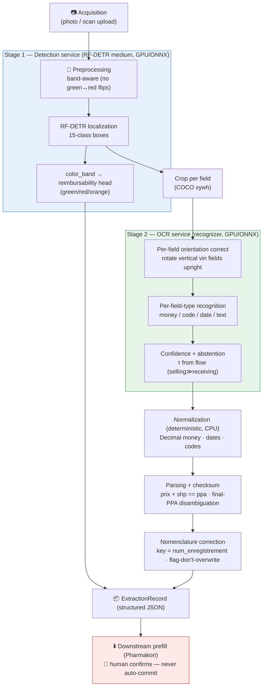
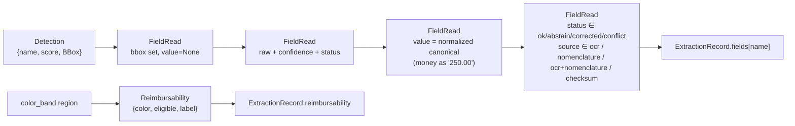
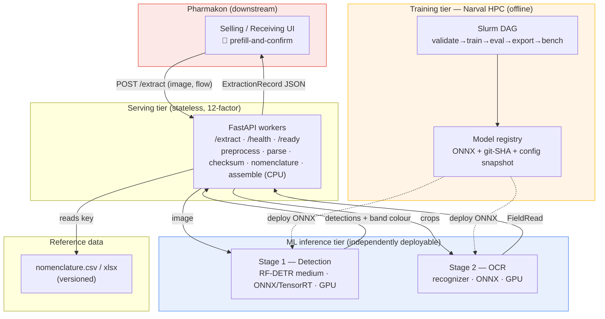

# VignOCR — System Architecture

VignOCR extracts structured, machine-readable data from photographed **Algerian
pharmaceutical vignettes** (the price/registration sticker on a medicine box). The
output is a single [`ExtractionRecord`](INTERFACES.md) — every field carried with its
value, confidence, status, source, and bounding box — that a downstream system
(Pharmakon) uses to **prefill** a sale or a goods-receipt, *never* to auto-commit one.

This document is the system view: how a photo becomes that record, where each stage
lives, what is independently deployable, and the one safety invariant that overrides
everything else.

> **Reality check (synthetic-first).** The real annotated dataset is **not ready** —
> current Roboflow exports carry only `{date_info, entete, vin}` / `{text, drug-labels}`,
> not the 15-class schema in [`configs/classes.yaml`](../configs/classes.yaml). The whole
> pipeline is therefore built and proven against a **deterministic synthetic fixture**
> that matches the target COCO schema exactly, and runs **on CPU today** with the
> detector/recognizer stubbed. Switchover to real data is a single
> `configs/data.yaml` change (`active: synthetic → real`); the code does not change.

---

## 1. The hard safety invariant

> ### 🛑 OCR never auto-commits. It prefills; a human confirms.
>
> No field value produced by this system is ever written to a transaction
> (a sale, a dispense, an inventory movement) without explicit human confirmation
> on the Pharmakon side. The pipeline's job is to produce a **trustworthy draft** with
> honest uncertainty, not a decision.

Three mechanisms enforce this:

1. **Abstention over guessing.** Any field whose confidence is below the active
   threshold gets `status="abstain"` (à vérifier) and is surfaced as blank-with-a-flag,
   never as a silently-guessed value. Thresholds come from
   [`configs/parsing/fields.yaml`](../configs/parsing/fields.yaml) → `abstention[flow]`,
   and the **selling** flow is stricter than **receiving** (a wrong dispense is
   unacceptable; see §7).
2. **Flag, don't overwrite, on medical conflict.** When OCR and the nomenclature
   disagree on a *dispensing-critical* field (`dosage`, `forme`), the field is marked
   `status="conflict"` and reported — it is **never** silently corrected
   ([`configs/nomenclature/correction.yaml`](../configs/nomenclature/correction.yaml) →
   `policy.flag_on_conflict`).
3. **Never-touch fields.** `ppa` and `tr` are vignette-specific; the nomenclature engine
   is forbidden from overwriting them (`policy.never_overwrite`).

Everything below serves this invariant: the pipeline maximizes *calibrated* accuracy and
makes uncertainty explicit so the human-in-the-loop has the minimum, highest-value set of
fields to confirm.

---

## 2. The 15-class field schema (single source of truth)

Every stage reads the field schema from [`configs/classes.yaml`](../configs/classes.yaml)
— synthetic generation, COCO loading, the detector head, OCR routing, parsing,
nomenclature correction, and the serving response all share these 15 names. Nothing
hardcodes a class name.

| id | name | type | orientation | role groups |
|----|------|------|-------------|-------------|
| 0 | `ppa` | money | horizontal | money, checksum |
| 1 | `prix` | money | horizontal | money, checksum |
| 2 | `shp` | money | horizontal | money, checksum |
| 3 | `num_enregistrement` | code | horizontal | anchor (nomenclature key) |
| 4 | `num_lot` | code | **vertical** | vin |
| 5 | `date_fab` | date | **vertical** | vin |
| 6 | `date_exp` | date | **vertical** | vin |
| 7 | `product_name` | text | horizontal | identity |
| 8 | `dci` | text | horizontal | identity, dispensing |
| 9 | `dosage` | text | horizontal | identity, dispensing |
| 10 | `forme` | text | horizontal | identity, dispensing |
| 11 | `laboratoire` | text | horizontal | identity |
| 12 | `entete` | region | horizontal | structural (body region) |
| 13 | `vin` | region | **vertical** | structural (rotated strip) |
| 14 | `color_band` | region | **diagonal** | reimbursability |

Three role facts drive the architecture:

- **Business-critical fields** — `[ppa, prix, shp, num_enregistrement, num_lot]` — are the
  ones the business rule depends on; detector eval must report **localization recall = 1.0**
  on them (§5, [DETECTION.md](DETECTION.md)).
- **Rotated fields** — `[num_lot, date_fab, date_exp, vin]` — are printed sideways inside
  the `vin` strip and must be **orientation-corrected before OCR** (§4, [OCR.md](OCR.md)).
- **`color_band`** is a *region* read for **colour → CHIFA reimbursability**, a signal
  entirely separate from text recognition (§8).

---

## 3. Pipeline overview

A photographed vignette flows through eight stages. The **detection** stage (Stage 1) and
the **recognition** stage (Stage 2) are the two heavy, independently-deployable ML
services; everything else is deterministic, pure-CPU Python.



### Stage-by-stage

| # | Stage | Module(s) | Compute | Output |
|---|-------|-----------|---------|--------|
| 1 | **Acquisition** | `serving/` (`POST /extract`) | CPU | validated image bytes + `flow` |
| 2 | **Preprocessing** | `pipeline/`, `detection/` | CPU | band-aware normalized image |
| 3 | **Detection + reimbursability** | `detection/` | **GPU / ONNX** | `list[Detection]`, `color_band` colour |
| 4 | **Crop + orientation correction** | `pipeline/`, `ocr/preprocess` | CPU | per-field upright crops |
| 5 | **OCR recognition** | `ocr/` | **GPU / ONNX** | `FieldRead` (raw text + confidence) |
| 6 | **Confidence + abstention** | `ocr/`, `parsing/` | CPU | `status` ∈ {ok, abstain} |
| 7 | **Normalization + parsing + checksum** | `parsing/` | CPU | Decimal money, dates, codes; `ChecksumReport` |
| 8 | **Nomenclature correction** | `nomenclature/` | CPU | repaired identity, `NomenclatureReport` |
| — | **Assemble + serve** | `pipeline/`, `serving/` | CPU | `ExtractionRecord` JSON |

---

## 4. Stage details

### 4.1 Acquisition

Entry point: FastAPI `POST /extract` (multipart image + `flow` query/body), defined in
[INTERFACES.md](INTERFACES.md) under `serving/`. The image is a **photograph** (phone
camera, variable lighting and perspective) of a physically fixed sticker layout — not a
clean scan. MIME/size validation, auth, and idempotency-key handling are per
`docs/SECURITY.md` / `docs/INTEGRATION.md`. Workers are stateless; all config flows from
env (12-factor).

### 4.2 Preprocessing — **band-aware**

Standard photometric cleanup (deskew, denoise, contrast) **with one inviolable
constraint**: nothing may alter the hue of the reimbursability `color_band`. The band's
colour *is* the CHIFA signal (green = remboursable, red = non-remboursable, orange = à
vérifier), so any operation that could flip green↔red is **forbidden** here and in
augmentation alike — no hue rotation, no random channel swaps, no aggressive colour
jitter on the band region. See [DETECTION.md §6](DETECTION.md) for the full
band-color-preserving augmentation policy and the rationale.

### 4.3 Stage 1 — RF-DETR detection + reimbursability

A single **RF-DETR medium** detector localizes all 15 classes in one forward pass
(`detection/infer.Detector(...).detect(image) -> list[Detection]`). The model choice and
its rationale for this *fixed-but-photographed* layout (DETR's global attention handles
perspective/clutter without anchor tuning; "medium" balances the small fixed label
inventory against export latency) is argued in [DETECTION.md](DETECTION.md).

The **reimbursability head** is a deliberately separate signal: the `color_band` region's
dominant colour is classified to `green`/`red`/`orange`, mapped to CHIFA eligibility per
`classes.yaml: reimbursability.colors`. `orange` (a real variant seen on some vignettes)
maps to `eligible=null` → **abstain** rather than guessing. This is *not* OCR — no text is
read from the band.

### 4.4 Crop + **per-field orientation correction**

Each detection box (COCO `xywh` in input-image pixels) is cropped. Fields in the
`rotated_fields` role — `num_lot`, `date_fab`, `date_exp`, and the `vin` strip itself — are
printed **vertically** and are rotated upright *before* OCR
(`ocr/preprocess.orient(crop, orientation) -> crop`). Orientation comes from each class's
`orientation` attribute in the schema (`horizontal` / `vertical` / `diagonal`), so the
correction is config-driven, not hardcoded per field. Feeding a sideways crop to a
horizontal-text recognizer is a primary, avoidable error source — this step removes it.

### 4.5 Stage 2 — OCR recognition

Each upright crop is recognized by a field-type-aware recognizer
(`ocr/infer.Recognizer(cfg).read(crop, field_type, orientation) -> FieldRead`). The
recognizer is routed by the field's `type` (`money` / `code` / `date` / `text`): money
crops use a digits-and-separators-biased decode, codes use an alphanumeric charset with a
confusion map, dates a date-token charset, free text the full charset. The baseline
(PaddleOCR/CRNN) vs transformer (TrOCR/Donut) decision, the evidence behind it, and the
per-field preprocessing are in [OCR.md](OCR.md).

### 4.6 Confidence + abstention

The recognizer attaches a calibrated `confidence` and compares it to the active
abstention threshold τ. Below τ → `status="abstain"`. τ is selected by `flow`:

```yaml
# configs/parsing/fields.yaml
abstention:
  selling:   { default: 0.90 }   # 🛑 stricter — a wrong dispense is unacceptable
  receiving: { default: 0.75 }
```

The same image read under `flow="selling"` will abstain on more fields than under
`flow="receiving"`; that is by design (§7).

### 4.7 Normalization + parsing + checksum (deterministic, CPU)

Pure-Python, no ML — and the **single strongest accuracy lever** in the system.

- **Money is `Decimal` end-to-end.** Parsing handles mixed locales (`"700.06"` and
  `"702,56"`), thousands separators, and currency tokens (`DA`/`DZD`), normalizes to a
  canonical decimal, and quantizes to the centime (`"0.01"`). Money is serialized to JSON
  as a **string** via `money_str(...)` — never a float
  (`parsing/money.parse(text) -> Decimal | None`).
- **Dates** parse the accepted formats and emit `%Y-%m`; `date_exp` must be after
  `date_fab` (sanity check).
- **Codes** — `num_enregistrement` is normalized to its `AA/BB/CC<LETTER>DDD/EEE`
  structure with the OCR confusion map applied on digit slots.
- **Checksum — `prix + shp == ppa`, exact to the centime.** If two of the three are
  confident (≥ `min_conf_to_anchor = 0.80`), the third is recomputed (verdict
  `repaired`); on a confident three-way disagreement the verdict is `mismatch` and the
  result is **flagged, never silently accepted**
  (`parsing/checksum.verify_and_repair(...) -> (fields, ChecksumReport)`).
- **Final-PPA disambiguation.** A vignette may print PPA twice — an intermediate
  `PPA: 700,06+2,50` and a final `PPA = 702,56 DA`. The parser deterministically selects
  the **final** `= XXX,XX DA` value, falling back to `prix + shp` if no final line is
  present (`parsing/ppa.disambiguate(candidates) -> FieldRead`).

### 4.8 Nomenclature correction (deterministic, CPU)

`num_enregistrement` is the **anchor**: it keys into the national nomenclature
(`fixtures/nomenclature.csv` now; the real Feb-2026 xlsx ingested via
`scripts/ingest_nomenclature.py` later). The normalized code is matched by
**structural edit distance** (rapidfuzz, `max_edit_distance = 2`, letter-block changes
weighted heaviest). On a match ≥ `min_match_confidence = 0.75`, the policy engine repairs
fields per [`configs/nomenclature/correction.yaml`](../configs/nomenclature/correction.yaml):

| Policy | Fields | Behaviour |
|--------|--------|-----------|
| `repair_always` | `product_name`, `laboratoire` | nomenclature is source of truth |
| `repair_if_ocr_low_or_agree` | `dci` | use nomenclature only if OCR abstained or already agrees |
| `flag_on_conflict` | `dosage`, `forme` | 🛑 dispensing-critical — conflict ⇒ `status="conflict"`, **never overwrite** |
| `never_overwrite` | `ppa`, `tr` | nomenclature must not touch these |

When OCR and nomenclature agree, the field is marked `source="ocr+nomenclature"` (highest
trust). Output is the repaired field set plus a `NomenclatureReport` listing every match
and conflict (`nomenclature/correct.apply(...) -> (fields, NomenclatureReport)`).

### 4.9 Assemble + serve

The orchestrator (`pipeline/orchestrator.VignocrPipeline(cfg).extract(image, *, flow)`)
runs the stages in order and assembles the [`ExtractionRecord`](INTERFACES.md): the
field map, reimbursability, checksum report, nomenclature report, the list of abstained
fields, the active `flow`, model versions, and per-stage timings. `serving/` emits this
Pydantic model directly as JSON.

---

## 5. Data flow — types at each boundary

The wire/in-memory contract is the set of Pydantic v2 models in
[`src/vignocr/common/schemas.py`](../src/vignocr/common/schemas.py) (mirrored in
[INTERFACES.md](INTERFACES.md)). Each field's lifecycle:



Key invariants on the wire:
- **`FieldStatus`** ∈ `ok | abstain | corrected | conflict | missing`.
- **`FieldSource`** ∈ `ocr | nomenclature | ocr+nomenclature | checksum | none`.
- **Money** values are Decimal **strings**, centime-quantized.
- **`abstentions`** is the list of field names with `status == "abstain"` — the exact set
  the human is asked to confirm.
- **`reimbursability.eligible`** is `True` (green) / `False` (red) / `None`
  (orange/unknown → à vérifier).

---

## 6. Deployment topology

The two ML stages are **independently deployable**: Stage 1 (detection) and Stage 2 (OCR)
are separate services with their own model artifacts, scaling profiles, and ONNX exports.
The deterministic core (preprocessing, parsing, checksum, nomenclature, assembly) lives in
the stateless API workers and runs on plain CPU. Training happens on **Narval HPC**
(Slurm/A100); only exported ONNX artifacts are shipped to serving.



**Why two services, not one monolith.** Detection and recognition have different compute
profiles (one box-regression pass vs many small crop reads), scale independently (you may
run several OCR replicas behind one detector), and version independently (re-export the
recognizer without retraining the detector). The deterministic core deliberately needs
**neither** GPU nor the `[ml]` extra, so the API tier and the entire test suite run on
CPU; the detector and recognizer can be **stubbed** with deterministic fixture readers
for end-to-end runs today.

### Degradation & abstention under failure
- If Stage 1 misses a business-critical box, that field is `status="missing"` →
  surfaced for manual entry (never fabricated).
- If Stage 2 is below τ, the field abstains (§7).
- If the nomenclature is unreachable or the code doesn't match, OCR values are kept and
  the anchor is flagged — identity repair is skipped, not faked.
- The checksum and date-sanity rules run even when a model is stubbed, so structural
  contradictions are always caught.

---

## 7. Selling vs receiving — two abstention profiles, one pipeline

The same pipeline serves two business flows, distinguished only by the `flow` argument and
its abstention threshold:

| Flow | Default τ | Rationale |
|------|-----------|-----------|
| **selling** | `0.90` (strict) | Dispensing the wrong drug/dose/lot is a patient-safety event. Prefer abstaining (asking the pharmacist) over a confident-but-wrong autofill. |
| **receiving** | `0.75` (looser) | Goods-in/stock entry tolerates more autofill; errors are caught downstream and are not dispensed to a patient. |

Selling is **strictly stricter**: it abstains on a superset of the fields receiving would.
This is the configurable expression of the §1 safety invariant — the cost of a wrong field
differs by flow, so the confidence bar does too. Per-field overrides
(e.g. `selling: { num_lot: 0.92 }`) attach in the same config block.

---

## 8. Reimbursability is not OCR

Worth restating because it is a common misreading of the schema: CHIFA reimbursability is
derived from the **colour** of the `color_band` region, not from any text. The detector
localizes the band; a colour classifier maps it to `green`/`red`/`orange`; the result is a
first-class `Reimbursability` object on the record, independent of every `FieldRead`. The
`orange` variant abstains (`eligible=null`) rather than forcing a yes/no. Keeping this
signal separate means a perfect-text read with an ambiguous band still correctly reports
"à vérifier", and a torn/over-OCR'd label still yields a reimbursability verdict if the
band is legible.

---

## 9. Configuration & operability

- **Single source of truth.** Classes, roles, regexes, thresholds, dataset location, and
  correction policy all live in `configs/` and load via `vignocr.common`
  (`load_config`, `get_classes`, `get_active_dataset`). No stage hardcodes any of them.
- **12-factor.** Active dataset (`VIGNOCR_DATA_ACTIVE`), repo root
  (`VIGNOCR_REPO_ROOT`), and config dir (`VIGNOCR_CONFIG_DIR`) are env-overridable; serving
  workers carry no state.
- **Determinism & provenance.** `seed_everything` at train/eval entrypoints; every
  training run records its git-SHA + config snapshot; `model_versions` on the record ties
  each output back to the `{detector, recognizer, nomenclature_version}` that produced it.
- **CPU-first.** The core imports and the full test suite run without `torch`/`rfdetr`/
  `paddleocr`; the `[ml]` extra is installed only on GPU/Narval hosts, and heavy libs are
  lazy-imported inside the functions that use them.

---

## 10. Cross-references

- [INTERFACES.md](INTERFACES.md) — canonical data types + per-module function signatures.
- [DETECTION.md](DETECTION.md) — Stage 1: RF-DETR medium, oriented fields, band-preserving
  augmentation, eval metrics, ONNX/TensorRT export.
- [OCR.md](OCR.md) — Stage 2: baseline vs transformer recognizer, per-field preprocessing,
  confidence + abstention, validation hooks.
- [ROADMAP.md](ROADMAP.md) — phased build plan with entry/exit gates.
- `configs/classes.yaml` · `configs/data.yaml` · `configs/parsing/fields.yaml` ·
  `configs/nomenclature/correction.yaml` — the contract these docs describe.
